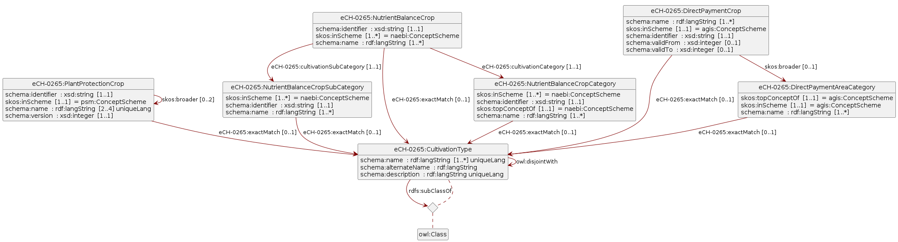

# eCH-0265 Landwirtschaftliche Kulturen
eCH Fachgruppe AgriFood
4. September 2026

- [Hinweis](#sec-note)
- [<span class="toc-section-number">1</span>
  Einleitung](#sec-introduction)
  - [<span class="toc-section-number">1.1</span> Was ist eine
    Kultur?](#sec-what-is-a-crop)
  - [<span class="toc-section-number">1.2</span>
    Direktzahlungen](#sec-direct-payments)
  - [<span class="toc-section-number">1.3</span>
    Nährstoffbilanz](#sec-nutrient-balance)
  - [<span class="toc-section-number">1.4</span>
    Pflanzenschutz](#sec-plant-protection)
- [<span class="toc-section-number">2</span>
  Datenmodell](#sec-data-model)
  - [<span class="toc-section-number">2.1</span> Nutzung von
    Semantic-Web-Technologien](#sec-linked-data)
- [<span class="toc-section-number">3</span> Klassen](#sec-classes)
  - [<span class="toc-section-number">3.1</span> Agronomische
    Kulturkategorie](#sec-nodeshape-nutrientbalancecrop)
  - [<span class="toc-section-number">3.2</span>
    Direktzahlungskultur](#sec-nodeshape-directpaymentcrop)
  - [<span class="toc-section-number">3.3</span> Flächenkategorie
    Direktzahlung](#sec-nodeshape-directpaymentareacategory)
  - [<span class="toc-section-number">3.4</span>
    Nutzungstyp](#sec-nodeshape-cultivationtype)
  - [<span class="toc-section-number">3.5</span>
    Nährstoffbilanz-Kultivierungskategorie](#sec-nodeshape-nutrientbalancecropcategory)
  - [<span class="toc-section-number">3.6</span>
    Nährstoffbilanz-Kultivierungsunterkategorie](#sec-nodeshape-nutrientbalancecropsubcategory)
  - [<span class="toc-section-number">3.7</span>
    Pflanzenschutzmittel-Kultur](#sec-nodeshape-plantprotectioncrop)
- [<span class="toc-section-number">4</span> Instruktionen zur
  Datenintegration](#sec-data-retrieval)
  - [<span class="toc-section-number">4.1</span> Bezug der Stammdaten
    über LINDAS](#sec-lindas-data-integration)
  - [<span class="toc-section-number">4.2</span> Bezug von
    Mapping-Tabellen](#sec-mapping-tables)
- [<span class="toc-section-number">5</span>
  Sicherheitsaspekte](#sec-safety-consideration)
- [<span class="toc-section-number">6</span>
  Haftungsausschluss](#sec-disclaimer)
- [<span class="toc-section-number">7</span>
  Urheberrechte](#sec-copyrights)
- [Anhang A - Referenzen](#sec-appendix-a)
- [Anhang B - Mitwirkung und Prüfung](#sec-appendix-b)
- [Anhang C - Abkürzungen und Glossar](#sec-appendix-c)
- [Anhang D - Änderungen gegenüber der Vorversion](#sec-appendix-d)
- [Anhang E - Abbildungsverzeichnis](#sec-appendix-e)
- [Anhang F - Tabellenverzeichnis](#sec-appendix-f)

# Hinweis

Im vorliegenden Dokument wird bei der Bezeichnung von Personen eine
geschlechtsneutrale Formulierung verwendet. Basis bildet der Leitfaden
der Bundeskanzlei. Je nach Situation kommen Paarformen (Bürgerinnen und
Bürger), geschlechtsabstrakte Formen (versicherte Person),
geschlechtsneutrale Formen (Versicherte) oder Umschreibungen ohne
Personenbezug zum Einsatz. Das generische Maskulin (Bürger) ist nicht
zulässig. Vollformen werden in fortlaufenden Texten verwendet, also in
Texten, die aus ausformulierten Sätzen bestehen. In verknappten
Textpassagen, namentlich in Tabellen, können Kurzformen verwendet
werden. Dabei wird die Kurzform mit Schrägstrich, aber ohne
Auslassungsstrich verwendet (Referent/in). Genderstern und ähnliche
Schreibweisen werden nicht verwendet.

# Einleitung

Die Definitionen für landwirtschaftliche Kulturen wurden historisch
unabhängig voneinander für spezifische gesetzliche Aufträge und Systeme
entwickelt. Die fehlende systemübergreifende Harmonisierung (mit einer
*Single Source of Truth*) erschwert jedoch die Informationsverarbeitung
über jeweilige Systemgrenzen hinaus.

Das vorliegende Hilfsmittel formuliert keine Vorgaben, sondern
unterstützt gezielt die reibungslose Datenintegration über verschiedene
Fachbereiche und Organisationen hinweg. Zu diesem Zweck stehen fertige
Kulturentabellen sowie die dazugehörigen Mapping-Tabellen zur Verfügung.
Alle definierten Ressourcen sind als *Linked Data* modelliert und lassen
sich vollständig automatisiert beziehen, was eine effiziente Überführung
von Daten aus einem System in ein anderes ermöglicht.

## Was ist eine Kultur?

Der Begriff der landwirtschaftlichen Kultur stützt sich in diesem
Hilfsmittel massgeblich auf das Konzept `CultivationType` aus der
Vorversion (<span class="nocase">eCH-Fachgruppe AgriFood</span> 2024).
Eine Kultur definiert sich demnach als Kategorie beziehungsweise als
Teil eines Kategorisierungssystems, welches die Art der Nutzung und
Kultivierung eines bestimmten Stücks Land über einen definierten
Zeitraum beschreibt.

Durch diese Definition ist die landwirtschaftliche Kultur strikt von der
botanischen Taxonomie abzugrenzen. Die botanische Systematik
klassifiziert einzelne Pflanzen. Die landwirtschaftliche Kultur hingegen
typisiert keine Individuen, sondern spezifische Formen der Landnutzung.
Es geht bei der Kultur folglich nicht um die biologische Pflanze an
sich, sondern um die flächen- und zeitbezogene Bewirtschaftungsform, an
welche die jeweiligen agronomischen, rechtlichen oder systemischen
Eigenschaften geknüpft sind.

Dieses Hilfsmittel dient dem Verständnis der Kulturbegriffe aus drei
unterschiedlichen Bereichen, in welchen Definitionen
landwirtschaftlicher Kulturen unabhängig voneinander gemacht wurden:

- [Direktzahlungen](#sec-direct-payments)
- [Nährstoffbilanz](#sec-nutrient-balance)
- [Pflanzenschutz](#sec-plant-protection)

In den folgenden Unterkapiteln werden die Kategorisierungssysteme
landwirtschaftlicher Kulturen dieser drei Bereiche im Detail
beschrieben.

## Direktzahlungen

Im Rahmen des Direktzahlungssystems sind 159 Direktzahlungskulturen
(Stand Juli 2026) definiert, welche im Rahmen der Strukturdatenerhebung
von den Bewirtschaftenden in den kantonalen Agrarinformationssystemen
(KAIS) eingetragen und an das agrarpolitische Informationssystem (AGIS)
des Bundes übermittelt werden können.

Alle Kulturen mit Direktzahlungscode müssen jährlich an AGIS übermittelt
werden – unabhängig davon, ob sie für Beiträge berechtigt sind oder
nicht (vgl. [Flächenkatalog und
Beitragsberechtigung](https://www.blw.admin.ch/dam/fr/sd-web/QYLa6wGfdK8G/2026%20Merkblatt%20Nr.%206.2%20Fl%C3%A4chenkatalog%20und%20Beitragsberechtigung.pdf)).
In AGIS stehen also alle aktuell gültigen und historisierten
Direktzahlungskulturen und deren Beitragsberechtigungen für Bund und
Kantone zur Verfügung. Momentan können diese Daten aber nicht in
maschinenlesbarer Form vom AGIS-Webservice bezogen werden.

Die Direktzahlungskulturen kommen nicht nur im Rahmen der
Strukturdatenerhebung zum Einsatz, sondern auch bei der
gesamtschweizerischen räumlichen Erfassung von Nutzungsflächen (siehe
[«landwirtschaftliche
Kulturflächen»](https://www.blw.admin.ch/de/landwirtschaftliche-kulturflaechen)).
Die Kantone erfassen diese Geodaten gemäss dem minimalen Geodatenmodell
153.1 «Nutzungsflächen» und stellen die Daten via dem interkantonalen
Portal [geodienste.ch](https://geodienste.ch/) zur Verfügung. Die im
Rahmen der Geodaten verwendeten Kulturkategorien sind als XML-File auf
<https://models.geo.admin.ch/BLW/> publiziert, wobei weitere
(aggregierende) Kulturkategorien definiert wurden und die Attribute
nicht zu 100% deckungsgleich zu denjenigen der Direktzahlungskulturen
der Strukturdatenerhebung sind.

Die Direktzahlungskulturen sind selbst in acht Kulturkategorien
eingeteilt (<a href="#tbl-directpaymentcrops-categories"
class="quarto-xref">Tabelle 1</a>). Eine Mehrheit dieser Kategorien wird
explizit in der landwirtschaftlichen Begriffsverordnung (LBV) definiert.

<div id="tbl-directpaymentcrops-categories">

Tabelle 1: Anzahl Direktzahlungskulturen (N) je Kulturkategorie
(Kategorie) mit Referenzen auf die geltende Definition in der
landwirtschaftlichen Begriffsverordnung (LBV), wo möglich.

| N | Kategorie | Definition | Beispiele |
|:---|:---|:---|:---|
| 72 | Ackerfläche | [Art. 18 LBV](https://www.fedlex.admin.ch/eli/cc/1999/13/de#art_18) | «Futterweizen gemäss Sortenliste swiss granum», «Winterraps zur Speiseölgewinnung», «Winterraps als nachwachsender Rohstoff» |
| 15 | Dauergrünfläche | [Art. 19 LBV](https://www.fedlex.admin.ch/eli/cc/1999/13/de#art_19) | «Extensiv genutzte Wiesen (ohne Weiden)», «Übrige Grünfläche (Dauergrünfläche), beitragsberechtigt» |
| 27 | Dauerkulturen | [Art. 22 LBV](https://www.fedlex.admin.ch/eli/cc/1999/13/de#art_22) | «Reben», «Obstanlagen (Äpfel)», «Reben (regionsspezifische Biodiversitätsförderfläche)» |
| 14 | Kulturen in ganzjährig geschütztem Anbau | [Art. 14 Abs. 1 Bst. e LBV](https://www.fedlex.admin.ch/eli/cc/1999/13/de#art_14) | «Gemüsekulturen in Gewächshäusern mit festem Fundament», «Übrige Spezialkulturen in geschütztem Anbau ohne festes Fundament» |
| 6 | Weitere Flächen innerhalb der landwirtschaftlichen Nutzfläche |  | «Streueflächen innerhalb der landwirtschaftlichen Nutzfläche», «Hecken-, Feld- und Ufergehölze (mit Pufferstreifen) (regionsspezifische Biodiversitätsförderfläche)» |
| 11 | Flächen ausserhalb der landwirtschaftlichen Nutzfläche |  | «Wald», «Trockenmauern», «Hausgärten» |
| 5 | Flächen im Sömmerungsgebiet | [Art. 24 LBV](https://www.fedlex.admin.ch/eli/cc/1999/13/de#art_24) | «Sömmerungsweiden», «Artenreiche Grün- und Streueflächen im Sömmerungsgebiet» |
| 9 | Andere Elemente |  | «Hochstammfeldobstbäume», «Nussbäume», «Einheimische standortgerechte Einzelbäume und Alleen» |

</div>

## Nährstoffbilanz

Um umweltbelastende Nährstoffverluste zu reduzieren und die
Ertragsfähigkeit der Böden nachhaltig zu sichern, müssen Schweizer
Landwirtschaftsbetriebe eine ausgeglichene Nährstoffbilanz ausweisen
(Carlen u. a. 2017). Das zentrale Berechnungsinstrument hierfür ist die
Suisse-Bilanz, welche den Nährstoffanfall (etwa durch Hofdünger) und den
Nährstoffbedarf auf Betriebsebene systematisch gegenüberstellt (Agridea
und Bundesamt für Landwirtschaft BLW 2025). Für diese Bilanzierung
wurden spezifische Kulturen definiert, weil jede landwirtschaftliche
Kultur einen anderen, normierten Nährstoffbedarf (z.B. für Stickstoff
oder Phosphor) aufweist (Carlen u. a. 2017). Die Zuweisung dieser
Kulturen ist die Grundvoraussetzung, um eine Nährstoffbilanz für einen
Betrieb berechnen zu können.

Um die Suisse-Bilanz zu berechnen, ist die «Wegleitung Suisse-Bilanz»
entscheidend, welche von Agridea und dem Bundesamt für Landwirtschaft
herausgegeben wird (Agridea und Bundesamt für Landwirtschaft BLW 2025).
In dem Dokument sind viele Referenztabellen enthalten, die entsprechend
nach Kulturen aufgegliedert sind, abgeleitet von den detaillierteren
Tabellen in Carlen u. a. (2017).

Zur Standardisierung der Suisse-Bilanz-Berechnung stellt das Bundesamt
für Landwirtschaft neu den Nährstoffbilanz-Berechnungsservice (NBBS) als
RESTful API zur Verfügung. Über diese Schnittstelle lässt sich unter
anderem ein Katalog der landwirtschaftlichen Kulturen abrufen.[^1] Der
NBBS ordnet die Kulturen in einer strikten, dreistufigen Hierarchie
(<a href="#tbl-nbbs-hierarchy" class="quarto-xref">Tabelle 2</a>).

<div id="tbl-nbbs-hierarchy">

Tabelle 2: Hierarchische Struktur der Kulturen im
Nährstoffbilanz-Berechnungsservice und Anzahl der Elemente (N) je
Klasse, Stand Juli 2026.

| N | Name | Beschreibung | Beispiele |
|:---|:---|:---|:---|
| 3 | Kultivierungskategorien (`cultivationcategories`) | Oberste Hierarchieebene, dient nur der Strukturierung. | Ackerkulturen, Grundfutterproduktion, Spezialkulturen |
| 8 | Kultivierungsunterkategorien (`cultivationsubcategories`) | Mittlere Ebene, dient ebenfalls nur der Strukturierung. | Getreide, Dauerkulturen, Hackfrüchte, Freilandgemüse, geschützte Kulturen, Grundfutter, übriger Ökoausgleich, diverse Kulturen |
| 314 | Agronomische Kulturkategorien (`agronomiccropcategories`) | Unterste Ebene, welche die eigentlichen Kulturen beinhaltet. Hier sind die spezifischen agronomischen und regulatorische Eigenschaften hinterlegt. | «Winterweizen», «Zuckerrüben», «Naturwiese extensiv», «Aubergine, Erdkultur (geschützter Anbau)», «Walnüsse ≥ 185 Bäume/ha» |

</div>

Während die beiden obersten Ebenen rein der Strukturierung und
Gruppierung dienen, weisen die agronomischen Kulturkategorien auf der
untersten Ebene spezifische agronomische und regulatorische
Eigenschaften auf. Dazu gehören beispielsweise der Ertrag, die
Zulässigkeit für bestimmte Direktzahlungsprogramme oder die Teilnahme an
spezifischen Vorhaben wie dem «62a Nitrat-Projekt».

## Pflanzenschutz

Das [Pflanzenschutzmittelverzeichnis (PSMV)](https://www.psm.admin.ch/)
ist das offizielle Register des Bundes, das alle in der Schweiz
zugelassenen Pflanzenschutzmittel auflistet. Es regelt, für welche
Kulturen und unter welchen Bedingungen diese rechtmässig eingesetzt
werden dürfen. Es wird vom Bundesamt für Lebensmittelsicherheit und
Veterinärwesen (BLV) gepflegt und umfasst 321 definierte Kulturen. Die
Bezeichnungen dieser Kulturen liegen mehrsprachig auf Deutsch,
Französisch und Italienisch sowie teilweise auf Englisch vor.

Anders als die streng monohierarchische Klassifikationen (wie in AGIS
und im NBBS) sind die Kulturen im PSMV als Objekte in einer flexiblen
Polyhierarchie modelliert. Dies bedeutet, dass ein Element mehr als ein
Überelement aufweisen kann, welches wiederum eigenen Überelementen
untergeordnet ist.

Diese Struktur wurde ursprünglich von der [*European Plant Protection
Organization* (EPPO)](https://eppo.int/) abgeleitet, anschliessend aber
für die spezifischen Schweizer Anforderungen weiter modifiziert. Die
Organisation in Übergruppen erlaubt eine äusserst flexible Modellierung:
Gewisse Äste der Hierarchie sind flach, während andere sehr tief
verschachtelt sein können. Eine Kultur kann dabei bis zu zwei direkte
Übergruppen besitzen. So ist beispielsweise die *Sommergerste* sowohl
der Übergruppe «Gerste» als auch dem «Sommergetreide» untergeordnet.

Die Hierarchietiefe kann bis zu fünf Übergruppen umfassen, wie folgendes
Beispiel aus dem Gemüsebau verdeutlicht:

1.  **Schnittsalat**, gehört zu
2.  **Blattsalate (Asteraceae)**, gehört zu
3.  **Lactuca-Salate**, gehört zu
4.  **Salate (Asteraceae)**, gehört zu
5.  **Korbblütler (Asteraceae)**, gehört zu
6.  **Gemüsebau allg.**

Die präzise Abbildung dieser Hierarchie ist fachlich von grosser
Bedeutung, da die Zulassungslogik direkt in die Struktur des PSMV
eingebaut ist. Wenn eine Pflanzenschutzmittel-Anwendung für eine
übergeordnete Kulturgruppe bewilligt ist, gilt diese Bewilligung
automatisch auch für sämtliche untergeordneten Kulturen.

Ein Beispiel hierfür: Das Herbizid [«Ariane
C»](https://www.psm.admin.ch/de/produkte/7430) darf gegen «ein- und
mehrjährige Dicotyledonen» in «Getreiden» eingesetzt werden. Damit darf
es auf alle Kulturen angewendet, welche vom PSMV als Getreide
klassifiziert sind. Mais, Buchweizen und Quinoa gehört in diesem System
aber explizit nicht zu den Getreiden – in der Systematik des NBBS aber
schon.[^2] Die korrekte Nachbildung dieser Polyhierarchie ist in den
Daten folglich essenziell, um Zulassungen maschinell korrekt zu
verarbeiten.

# Datenmodell

## Nutzung von Semantic-Web-Technologien

Im Gegensatz zum Pflanzenschutzmittelverzeichnis wird beim
Nährstoffbilanzrechner Mais als Getreide gezählt – es existieren also
verschiedene Definitionen von Getreide. Um diese eindeutig kennzeichnen
zu können, setzen wir auf Linked Data. Für weiterführende Informationen
zur Publikation, Nutzung und den Kernprozessen von vernetzten Daten
verweisen wir auf <span class="nocase">eCH-Fachgruppe Open Government
Data</span> (2018).

Das konsolidierte Datenmodell wird durch eine RDFS-Ontologie abgebildet
und mittels SHACL-Shapes validiert (Cyganiak u. a. 2014; W3C OWL Working
Group 2012; Knublauch und Kontokostas 2017).

<div id="fig-uml">



Abbildung 1: UML-Diagramm des Datenmodells von eCH-0265. Dieses Diagramm
wurde automatisch mithilfe von SHACL PLAY! (Francart 2020) aus den
SHACL-Spezifikationen generiert.

</div>

<a href="#fig-uml" class="quarto-xref">Abbildung 1</a> veranschaulicht
die grundlegende Architektur des semantischen Modells: Im Zentrum steht
eine generische Referenzklasse (`eCH-0265:CultivationType`). Die
Kulturhierarchien der drei verschiedenen Bereiche (Direktzahlungen,
Nährstoffbilanz und Pflanzenschutz) sind jeweils als SKOS-Konzeptschema
modelliert. Jede Kultur kann dabei auf die zentrale Referenzklasse
“zeigen”. Dieser modulare Aufbau erlaubt es, die historisch gewachsenen,
in sich geschlossenen Kategoriensysteme unter Beibehaltung ihrer
spezifischen fachlichen und rechtlichen Eigenschaften in einem
gemeinsamen Graphen abzubilden und trotzdem miteinander zu verknüpfen.

# Klassen

## Agronomische Kulturkategorie

Unterste Hierarchieebene, welche die eigentlichen Kulturen mit
spezifischen agronomischen Eigenschaften für die Suisse-Bilanz
beinhaltet.

<div id="tbl-nodeshape-nutrientbalancecrop">

Tabelle 3: Eigenschaften Agronomische Kulturkategorie

| Beschreibung | Pfad | Typ | Kard. |
|:---|:---|:---|---:|
| **Identifikator** | `schema:identifier` | `xsd:string` oder `sh:Literal` | 1..1 |
| **Konzeptschema** | `skos:inScheme` | `sh:IRI` | 1..\* |
| **Name** | `schema:name` | `rdf:langString` oder `sh:Literal` | 1..\* |
| **Unterkategorie** | `eCH-0265:cultivationSubCategory` | [`eCH-0265:NutrientBalanceCropSubCategory`](#sec-nodeshape-nutrientbalancecropsubcategory) | 1..1 |
| **Kategorie** | `eCH-0265:cultivationCategory` | [`eCH-0265:NutrientBalanceCropCategory`](#sec-nodeshape-nutrientbalancecropcategory) | 1..1 |
| **Kultivierungstyp**: Der dieser bereichsspezifischen Kultur korrespondierende Kultivierungstyp in der Kulturenontologie. | `eCH-0265:exactMatch` | [`eCH-0265:CultivationType`](#sec-nodeshape-cultivationtype) | 0..1 |

</div>

## Direktzahlungskultur

Beschreibt eine Liste der «Kulturen», die gemäss
Direktzahlungsverordnung (DZV) im Bereich Landwirtschaft relevant sind.
Diese «Kulturen» werden für den Direktzahlungsvollzug verwendet. Sie
entsprechen den Hauptkulturen.

<div id="tbl-nodeshape-directpaymentcrop">

Tabelle 4: Eigenschaften Direktzahlungskultur

| Beschreibung | Pfad | Typ | Kard. |
|:---|:---|:---|---:|
|  | `skos:broader` | [`eCH-0265:DirectPaymentAreaCategory`](#sec-nodeshape-directpaymentareacategory) oder `sh:IRI` | 0..1 |
|  | `skos:inScheme` | `sh:IRI` | 1..1 |
| **Name**: Die offizielle Bezeichnung dieser Direktzahlungskultur, abgeglichen mit der Landwirtschaftlichen Begriffsverordnung (LBV). | `schema:name` | `rdf:langString` oder `sh:Literal` | 1..\* |
| **Identifikator**: Der LNF-Code, auch Kulturcode genannt, ist der allgemein gebräuchliche Identifikator für Direktzahlungskulturen in der Schweiz. | `schema:identifier` | `xsd:string` oder `sh:Literal` | 1..1 |
| **Gültig von**: Ab welchem Jahr wurde diese Direktzahlungskultur offiziell verwendet? | `schema:validFrom` | `xsd:integer` oder `sh:Literal` | 0..1 |
| **Gültig bis**: Bis in welchem Jahr wurde diese Direktzahlungskultur offiziell verwendet? | `schema:validTo` | `xsd:integer` oder `sh:Literal` | 0..1 |
| **Kultivierungstyp**: Der dieser bereichsspezifischen Kultur korrespondierende Kultivierungstyp in der Kulturenontologie. | `eCH-0265:exactMatch` | [`eCH-0265:CultivationType`](#sec-nodeshape-cultivationtype) | 0..1 |

</div>

## Flächenkategorie Direktzahlung

<div id="tbl-nodeshape-directpaymentareacategory">

Tabelle 5: Eigenschaften Flächenkategorie Direktzahlung

| Beschreibung | Pfad | Typ | Kard. |
|:---|:---|:---|---:|
|  | `skos:topConceptOf` | `sh:IRI` | 1..1 |
|  | `skos:inScheme` | `sh:IRI` | 1..1 |
| **Name** | `schema:name` | `rdf:langString` oder `sh:Literal` | 1..\* |
| **Kultivierungstyp**: Der dieser bereichsspezifischen Kultur korrespondierende Kultivierungstyp in der Kulturenontologie. | `eCH-0265:exactMatch` | [`eCH-0265:CultivationType`](#sec-nodeshape-cultivationtype) | 0..1 |

</div>

## Nutzungstyp

Die Kernklasse für die Klassifikation von «Kulturen», bzw.
Landnutzungen. Eine (teilweise) Übersetzung anderer Kulturarten ist über
die mit dieser Klasse modellierte Hierarchie möglich. Für die allgemeine
Hierarchiemodellierung wird das [*RDF-Schema*
(RDFS)](https://www.w3.org/TR/rdf-schema/) sowie die [*Web Ontology
Language* (OWL)](https://www.w3.org/TR/owl-guide/) verwendet.

<div id="tbl-nodeshape-cultivationtype">

Tabelle 6: Eigenschaften Nutzungstyp

| Beschreibung | Pfad | Typ | Kard. |
|:---|:---|:---|---:|
| **Name** | `schema:name` | `rdf:langString` oder `sh:Literal` | 1..\* |
| **Alias** | `schema:alternateName` | `rdf:langString` oder `sh:Literal` | 0..\* |
| **Beschreibung** | `schema:description` | `rdf:langString` oder `sh:Literal` | 0..\* |
| **Übergeordneter Nutzungstyp** | `rdfs:subClassOf` | [`eCH-0265:CultivationType`](#sec-nodeshape-cultivationtype) oder `owl:Class` | 0..\* |
|  | `owl:disjointWith` | [`eCH-0265:CultivationType`](#sec-nodeshape-cultivationtype) oder `sh:IRI` | 0..\* |

</div>

## Nährstoffbilanz-Kultivierungskategorie

Oberste Hierarchieebene der Kulturen im
Nährstoffbilanz-Berechnungsservice, dient der reinen Strukturierung.

<div id="tbl-nodeshape-nutrientbalancecropcategory">

Tabelle 7: Eigenschaften Nährstoffbilanz-Kultivierungskategorie

| Beschreibung | Pfad | Typ | Kard. |
|:---|:---|:---|---:|
| **Identifikator** | `schema:identifier` | `xsd:string` oder `sh:Literal` | 1..1 |
| **Konzeptschema** | `skos:inScheme` | `sh:IRI` | 1..\* |
| **Oberstes Konzept von** | `skos:topConceptOf` | `sh:IRI` | 1..1 |
| **Name** | `schema:name` | `rdf:langString` oder `sh:Literal` | 1..\* |
| **Kultivierungstyp**: Der dieser bereichsspezifischen Kultur korrespondierende Kultivierungstyp in der Kulturenontologie. | `eCH-0265:exactMatch` | [`eCH-0265:CultivationType`](#sec-nodeshape-cultivationtype) | 0..1 |

</div>

## Nährstoffbilanz-Kultivierungsunterkategorie

Mittlere Hierarchieebene der Kulturen im
Nährstoffbilanz-Berechnungsservice.

<div id="tbl-nodeshape-nutrientbalancecropsubcategory">

Tabelle 8: Eigenschaften Nährstoffbilanz-Kultivierungsunterkategorie

| Beschreibung | Pfad | Typ | Kard. |
|:---|:---|:---|---:|
| **Identifikator** | `schema:identifier` | `xsd:string` oder `sh:Literal` | 1..1 |
| **Konzeptschema** | `skos:inScheme` | `sh:IRI` | 1..\* |
| **Name** | `schema:name` | `rdf:langString` oder `sh:Literal` | 1..\* |
| **Kultivierungstyp**: Der dieser bereichsspezifischen Kultur korrespondierende Kultivierungstyp in der Kulturenontologie. | `eCH-0265:exactMatch` | [`eCH-0265:CultivationType`](#sec-nodeshape-cultivationtype) | 0..1 |

</div>

## Pflanzenschutzmittel-Kultur

Kultur, wie sie im
[Pflanzenschutzmittelverzeichnis](https://psm.admin.ch/) modelliert ist.
Diese Kulturen sind über die Attribute `schema:isPartOf` sowie
`schema:hasPart` hierarchisch organisiert.

<div id="tbl-nodeshape-plantprotectioncrop">

Tabelle 9: Eigenschaften Pflanzenschutzmittel-Kultur

| Beschreibung | Pfad | Typ | Kard. |
|:---|:---|:---|---:|
| **Identifikator** | `schema:identifier` | `xsd:string` oder `sh:Literal` | 1..1 |
| **Konzeptschema** | `skos:inScheme` | `sh:IRI` | 1..1 |
| **Name**: Der in Infofito eingetragene Name dieser Kultur. | `schema:name` | `rdf:langString` oder `sh:Literal` | 2..4 |
| **Version** | `schema:version` | `xsd:integer` oder `sh:Literal` | 1..1 |
| **Überkultur** | `skos:broader` | `skos:Concept` oder `sh:IRI` | 0..2 |
| **Kultivierungstyp**: Der dieser bereichsspezifischen Kultur korrespondierende Kultivierungstyp in der Kulturenontologie. | `eCH-0265:exactMatch` | [`eCH-0265:CultivationType`](#sec-nodeshape-cultivationtype) | 0..1 |

</div>

# Instruktionen zur Datenintegration

Die diesem Dokument zugrundeliegenden Master- und Referenzdaten sind als
*Linked Data* verfügbar.

Die technologische Basis dafür bildet das [Resource Description
Framework (RDF)](https://www.w3.org/TR/rdf11-concepts/), ein zentraler
Standard des World Wide Web Consortiums (W3C) zur Modellierung von
Datenstrukturen im Web. In RDF werden Informationen nicht in klassischen
Tabellen, sondern als vernetzte Graphen abgebildet. Jede Aussage besteht
dabei aus einem sogenannten Triple (Subjekt, Prädikat, Objekt). Diese
Struktur ermöglicht eine maschinenlesbare, interoperable und
systemübergreifend eindeutige Beschreibung von Ressourcen und deren
Relationen zueinander.

Für die Speicherung und Publikation dieser RDF-Daten wird
[LINDAS](https://lindas.admin.ch/) (Linked Data Service) genutzt, der
offizielle Linked-Data-Dienst der Schweizer Bundesverwaltung. LINDAS
fungiert als sogenannter *Triple Store*, einer spezialisierte
Graphdatenbank, die für das effiziente Speichern und Abfragen von
RDF-Triples optimiert ist und die Daten öffentlich über eine genormte
Schnittstelle bereitstellt.

Das folgende Kapitel gibt eine minimale Anleitung, wie die Daten von
LINDAS abgefragt und bezogen werden können.

## Bezug der Stammdaten über LINDAS

Die Kulturenstammdaten können als Linked Data mittels der Abfragesprache
[SPARQL 1.1 Query Language](https://www.w3.org/TR/sparql11-query/)
direkt aus dem LINDAS-Triplestore bezogen werden. Das nachfolgende
generische Beispiel zeigt eine einfache Abfrage, welche sämtliche
Nutzungstypen mit deren deutschem Namen zurückgibt:

``` rq
# Table of all cultivation types and their German name
PREFIX eCH-0265: <https://agriculture.ld.admin.ch/eCH-0265/2/>
PREFIX schema: <http://schema.org/>

SELECT *
FROM <https://lindas.admin.ch/foag/ech/0265/2>
WHERE {
  ?crop a eCH-0265:CultivationType ;
    schema:name ?name .
  FILTER(LANG(?name) = "de")
}
ORDER BY ?name
```

Auf <https://lindas.admin.ch/sparql/> können solche Abfragen manuell
über eine graphische Benutzeroberfläche ausgeführt werden.

Weitere praxisnahe Abfragebeispiele stehen im [GitHub Repository unter
src/sparql/queries](https://github.com/blw-ofag-ufag/eCH-0265/tree/main/src/sparql/queries)
zur Verfügung.

Für den automatisierten Datenabruf und die Systemintegration kann der
LINDAS-Endpunkt über einen HTTP-POST-Request angesprochen werden. Dabei
wird die SPARQL-Abfrage direkt im Body der Anfrage übermittelt. Ein
entsprechendes Aufrufbeispiel mit `curl` sieht folgendermassen aus:

``` sh
curl -X POST "https://lindas.admin.ch/query" \
     -H "Content-Type: application/sparql-query" \
     -H "Accept: application/sparql-results+json" \
     --data-binary @query.rq -o data.json
```

Dieser Aufruf setzt voraus, dass eine gültige SPARQL-Abfrage in der
lokalen Datei `query.rq` vorliegt. Je nach Anforderung lässt sich das
Rückgabeformat über den `Accept`-Header steuern. Für `SELECT`-Abfragen
unterstützt LINDAS standardmässig strukturierte Formate wie JSON
(`application/sparql-results+json`), XML
(`application/sparql-results+xml`) und CSV (`text/csv`).

## Bezug von Mapping-Tabellen

Um die Beziehungen zwischen den Kulturen der unterschiedlichen Systeme
aufzuzeigen, werden Mapping-Tabellen bereitgestellt. Diese dienen als
«Übersetzung» zwischen dem Direktzahlungssystem (AGIS), dem
Nährstoffbilanz-Berechnungsservice (NAEBI) und dem
Pflanzenschutzmittelverzeichnis (PSM).

Die Relationen der Kulturen zueinander werden durch Beziehungen des
*Simple Knowledge Organization System* (SKOS) klassifiziert:

- `skos:exactMatch`: Verknüpft zwei Konzepte (d.h. Kulturen aus zwei
  Systemen) bei denen genau dasselbe gemeint ist.
- `skos:narrowMatch` und `skos:broadMatch`: Beschreiben eine
  hierarchische Zuordnung zwischen zwei Konzepten, wobei die beiden
  Beziehungen zueinander invers sind.

<div id="tbl-mapping-example">

Tabelle 10: Beispiele der Mapping-Relationen

| Quellsystem | Kultur Quellsystem | SKOS-Beziehung | Zielsystem | Kultur Zielsystem | Anmerkung |
|:---|:---|:---|:---|:---|:---|
| AGIS | Sommergerste | `skos:exactMatch` | NAEBI | Sommergerste | Die Kulturen im Quell- und Zielsystem sind synonym. |
| AGIS | Wintergerste | `skos:narrowMatch` | NAEBI | Wintergerste in 62a Nitrat-Projekt | Die Kultur im Zielsystem ist spezifischer als jene im Quellsystem. |
| AGIS | Emmer, Einkorn | `skos:broadMatch` | PSM | Getreide | Die Kultur im Quellsystem ist spezifischer als jene im Zielsystem. |

</div>

Die Prädikate `skos:exactMatch`, `skos:narrowMatch` und
`skos:broadMatch` werden im Verarbeitungsprozess direkt an die Kulturen
im Graphen angehängt und sind auf LINDAS abfragbar. Die Generierung
erfolgt über das SPARQL-Skript
`src/sparql/processing/02_mapping_table_skos_generation.rq` mittels
`INSERT`-Befehlen.

> [!NOTE]
>
> Im Datenverarbeitungsprozess werden hierarchische Prädikate
> (`narrowMatch`, `broadMatch`) nur dann generiert, wenn für eine Kultur
> aus einem Quellsystem nicht bereits ein `skos:exactMatch` im
> jeweiligen Zielsystem gefunden wurde. Dies verhindert redundante
> synonyme und hierarchische Beziehungen für dieselbe Kultur und fördert
> die Übersichtlichkeit der resultierenden Mapping-Tabelle.

Eine vorbereitete SPARQL-Abfrage zur Generierung der vollständigen
Mapping-Tabelle (AGIS, NAEBI und PSM) befindet sich [im eCH-0265
Repository unter
`src/sparql/queries/mapping_table.rq`](https://github.com/blw-ofag-ufag/eCH-0265/blob/main/src/sparql/queries/mapping_table.rq).

Diese Abfrage kann direkt in der Benutzeroberfläche von
[LINDAS](https://lindas.admin.ch/sparql/) ausgeführt und als CSV oder
JSON exportiert werden. Alternativ lässt sich die Tabelle programmatisch
beziehen, siehe <a href="#sec-lindas-data-integration"
class="quarto-xref">Kapitel 4.1</a>.

# Sicherheitsaspekte

Informationen zu den ausdrücklich massgeblichen rechtlichen Grundlagen
oder ein Hinweis darauf, dass bei der Umsetzung die entsprechenden
rechtlichen Grundlagen zu beachten sind.

# Haftungsausschluss

eCH-Standards, die der Verein eCH dem Anwender kostenlos zur Verfügung
stellt oder die auf eCH verweisen, haben nur den Status von
Empfehlungen. Der Verein eCH haftet in keinem Fall für Entscheidungen
oder Massnahmen, die der Anwender auf der Grundlage dieser Dokumente
trifft bzw. ergreift. Der Anwender ist dafür verantwortlich, die
Dokumente vor ihrer Verwendung selbst zu überprüfen und gegebenenfalls
fachlichen Rat einzuholen. eCH-Standards können und sollen die
technische, organisatorische oder rechtliche Beratung im Einzelfall
nicht ersetzen.

Dokumente, Verfahren, Methoden, Produkte und Standards, auf die in
eCH-Standards verwiesen wird, sind möglicherweise durch Marken-,
Urheber- oder Patentrechte geschützt. Es liegt in der ausschliesslichen
Verantwortung des Anwenders, die erforderlichen Lizenzen von den
berechtigten Personen und/oder Organisationen einzuholen.

Obwohl der Verein eCH bei der Erstellung der eCH-Standards mit
angemessener Sorgfalt vorgegangen ist, kann er keine Gewährleistung oder
Garantie dafür übernehmen, dass die bereitgestellten Informationen und
Dokumente aktuell, vollständig, richtig oder fehlerfrei sind. eCH behält
sich das Recht vor, die Inhalte der eCH-Standards jederzeit und ohne
vorherige Ankündigung zu ändern.

Jede Haftung für Schäden, die durch die Nutzung der eCH-Standards durch
den Anwender entstehen, wird im gesetzlich zulässigen Rahmen
ausgeschlossen.

# Urheberrechte

Personen, die eCH-Standards erarbeiten, bleiben Inhaber ihrer geistigen
Eigentumsrechte. Diese Personen verpflichten sich jedoch, ihre geistigen
Eigentumsrechte oder andere Rechte an geistigen Eigentumsrechten
Dritter, soweit möglich, den jeweiligen Fachgruppen und dem Verein eCH
kostenlos und zur uneingeschränkten Nutzung und Weiterentwicklung im
Rahmen des Vereinszwecks zur Verfügung zu stellen.

Die von den Fachgruppen erarbeiteten Standards dürfen unter Nennung des
jeweiligen Autors von eCH kostenlos und in uneingeschränktem Umfang
genutzt, verbreitet und weiterentwickelt werden.

eCH-Standards sind vollständig dokumentiert und frei von lizenz-
und/oder patentrechtlichen Einschränkungen. Die dazugehörige
Dokumentation kann kostenlos angefordert werden. Diese Bestimmungen
gelten jedoch nur für die von eCH erarbeiteten Standards, nicht aber für
Standards oder Produkte Dritter, die auf eCH-Standards verweisen. Die
Standards enthalten die entsprechenden Hinweise auf Rechte Dritter.

# Anhang A - Referenzen

<div id="refs" class="references csl-bib-body hanging-indent">

<div id="ref-suibi2025" class="csl-entry">

Agridea, und Bundesamt für Landwirtschaft BLW. 2025. *Wegleitung
Suisse-Bilanz: Version 1.20*. Agridea und Bundesamt für Landwirtschaft
BLW.
<https://www.blw.admin.ch/dam/de/sd-web/PCfDBOdwjaOm/WegleitungSuisse-Bilanz1_20_D_DEF.pdf>.

</div>

<div id="ref-grud2017" class="csl-entry">

Carlen, C., R. Flisch, C. Gilli, u. a. 2017. «Grundlagen für die Düngung
landwirtschaftlicher Kulturen in der Schweiz (GRUD 2017)».
*Agrarforschung Schweiz* 8 (6).
<https://ira.agroscope.ch/de-CH/publication/52563>.

</div>

<div id="ref-rdf" class="csl-entry">

Cyganiak, Richard, David Wood, und Markus Lanthaler. 2014. *RDF 1.1
Concepts and Abstract Syntax*. W3C Recommendation. World Wide Web
Consortium (W3C). <https://www.w3.org/TR/rdf11-concepts/>.

</div>

<div id="ref-eCH-0265:1.0.0" class="csl-entry">

<span class="nocase">eCH-Fachgruppe AgriFood</span>. 2024. *eCH-0205
Datenstandard Agrardaten – Flächen und Kulturen*. eCH-Standard. Version
1.0.0. Verein eCH.
<https://ech.ch/sites/default/files/imce/eCH-Dossier/eCH-Dossier_PDF_Publikationen/Hauptdokument/STAN_d_DEF_2024-02_07_eCH-0265_V1.0.0_Datenstandard_Agrardaten_Fl%C3%A4chenKulturen.pdf>.

</div>

<div id="ref-eCH-0205:1.0.0" class="csl-entry">

<span class="nocase">eCH-Fachgruppe Open Government Data</span>. 2018.
*eCH-0205 Linked Open Data*. eCH-Hilfsmittel. Version 1.0.0. Verein eCH.
<https://www.ech.ch/sites/default/files/dosvers/hauptdokument/AUXI_e_DEF_2018-03-13_eCH-0205_V1.0_Linked%20Open%20Data.pdf>.

</div>

<div id="ref-francart2020shacl" class="csl-entry">

Francart, Thomas. 2020. *SHACL Play!* Sparna, released.
<https://shacl-play.sparna.fr/>.

</div>

<div id="ref-shacl" class="csl-entry">

Knublauch, Holger, und Dimitris Kontokostas. 2017. *Shapes Constraint
Language (SHACL)*. W3C Recommendation. World Wide Web Consortium (W3C).
<https://www.w3.org/TR/shacl/>.

</div>

<div id="ref-owl2" class="csl-entry">

W3C OWL Working Group. 2012. *OWL 2 Web Ontology Language Document
Overview (Second Edition)*. W3C Recommendation. World Wide Web
Consortium (W3C). <https://www.w3.org/TR/owl2-overview/>.

</div>

</div>

# Anhang B - Mitwirkung und Prüfung

<div id="tbl-authors">

Tabelle 11: Autoren und Revision

| Name            | Organisation                 |
|:----------------|:-----------------------------|
| Marc Beringer   | Bundesamt für Landwirtschaft |
| Damian Oswald   | Bundesamt für Landwirtschaft |
| Lea Stauber     | Bundesamt für Landwirtschaft |
| Christian Wilda | Bundesamt für Landwirtschaft |

</div>

# Anhang C - Abkürzungen und Glossar

<div id="tbl-glossary">

Tabelle 12: **Glossar des Standards eCH-0265:** Diese Glossar soll
sämtliche verwendeten Fachbegriffe inklusive Abkürzungen des Standards
eCH-0265 enthalten.

<table>
<colgroup>
<col style="width: 20%" />
<col style="width: 25%" />
<col style="width: 55%" />
</colgroup>
<thead>
<tr>
<th style="text-align: left;">IRI</th>
<th style="text-align: left;">Begriff</th>
<th style="text-align: left;">Beschreibung</th>
</tr>
</thead>
<tbody>
<tr>
<td style="text-align: left;"><a
href="https://agriculture.ld.admin.ch/eCH-0265/2/term/agis"><code>term:agis</code></a></td>
<td style="text-align: left;"><strong>Agrarpolitisches
Informationssystem</strong> (AGIS)</td>
<td style="text-align: left;">Das agrarpolitische Informationssystem des
Bundes, an welches im Rahmen der Strukturdatenerhebung Daten zu
Direktzahlungskulturen übermittelt werden.</td>
</tr>
<tr>
<td style="text-align: left;"><a
href="https://agriculture.ld.admin.ch/eCH-0265/2/term/kais"><code>term:kais</code></a></td>
<td style="text-align: left;"><strong>Kantonales
Agrarinformationssystem</strong> (KAIS)</td>
<td style="text-align: left;">Informationssystem auf Kantonsebene, in
welches Bewirtschaftende im Rahmen der Strukturdatenerhebung ihre Daten
eintragen.</td>
</tr>
<tr>
<td style="text-align: left;"><a
href="https://agriculture.ld.admin.ch/eCH-0265/2/term/lindas"><code>term:lindas</code></a></td>
<td style="text-align: left;"><strong>Linked Data Service</strong>
(LINDAS)</td>
<td style="text-align: left;">Der offizielle Linked-Data-Dienst der
Schweizer Bundesverwaltung, der als Triple Store fungiert.</td>
</tr>
<tr>
<td style="text-align: left;"><a
href="https://agriculture.ld.admin.ch/eCH-0265/2/term/nbbs"><code>term:nbbs</code></a></td>
<td
style="text-align: left;"><strong>Nährstoffbilanz-Berechnungsservice</strong>
(NBBS)</td>
<td style="text-align: left;">Eine vom Bundesamt für Landwirtschaft
bereitgestellte RESTful API zur Standardisierung der
Suisse-Bilanz-Berechnung.</td>
</tr>
<tr>
<td style="text-align: left;"><a
href="https://agriculture.ld.admin.ch/eCH-0265/2/term/rdf"><code>term:rdf</code></a></td>
<td style="text-align: left;"><strong>Resource Description
Framework</strong> (RDF)</td>
<td style="text-align: left;">Ein zentraler Standard des World Wide Web
Consortiums (W3C) zur Modellierung von Datenstrukturen im Web.
Informationen werden nicht in klassischen Tabellen, sondern als
vernetzte Graphen abgebildet.</td>
</tr>
<tr>
<td style="text-align: left;"><a
href="https://agriculture.ld.admin.ch/eCH-0265/2/term/skos"><code>term:skos</code></a></td>
<td style="text-align: left;"><strong>Simple Knowledge Organization
System</strong> (SKOS)</td>
<td style="text-align: left;"></td>
</tr>
<tr>
<td style="text-align: left;"><a
href="https://agriculture.ld.admin.ch/eCH-0265/2/term/srppp"><code>term:srppp</code></a></td>
<td
style="text-align: left;"><strong>Pflanzenschutzmittelverzeichnis</strong>
(PSM-V)</td>
<td style="text-align: left;">Das offizielle Register des Bundes,
gepflegt vom BLV, das alle in der Schweiz zugelassenen
Pflanzenschutzmittel sowie deren rechtmässigen Einsatzbereich
auflistet.</td>
</tr>
<tr>
<td style="text-align: left;"><a
href="https://agriculture.ld.admin.ch/eCH-0265/2/term/suibi"><code>term:suibi</code></a></td>
<td style="text-align: left;"><strong>Suisse-Bilanz</strong></td>
<td style="text-align: left;">Zentrales Berechnungsinstrument, das den
Nährstoffanfall und -bedarf auf Betriebsebene systematisch
gegenüberstellt, um eine ausgeglichene Nährstoffbilanz auszuweisen.</td>
</tr>
<tr>
<td style="text-align: left;"><a
href="https://agriculture.ld.admin.ch/eCH-0265/2/term/triple"><code>term:triple</code></a></td>
<td style="text-align: left;"><strong>Tripel</strong></td>
<td style="text-align: left;"><p>Die Grundstruktur einer Aussage in RDF,
bestehend aus Subjekt, Prädikat und Objekt.</p>
<p><em>Oberbegriff</em>: <a
href="https://agriculture.ld.admin.ch/eCH-0265/2/term/rdf"><code>term:rdf</code></a></p></td>
</tr>
</tbody>
</table>

</div>

# Anhang D - Änderungen gegenüber der Vorversion

Das vorliegende Dokument ist ein Hilfsmittel zur harmonisierten,
systemübergreifenden Nutzung von landwirtschaftlichen Kulturdaten in der
Schweiz. Gegenüber der Version 1.1.0 (eCH-0265 Datenstandard Agrardaten
– Flächen und Kulturen) wurde das Dokument von einem unverbindlichen
Standard zu einem Hilfsmittel umgewandelt. Gleichzeitig wurde der
inhaltliche Fokus geschärft: Klassen rund um Geometrien/Flächen[^3],
Sorten sowie Direktzahlungsprogrammen sind nicht mehr Teil dieses
Dokuments.[^4] Neu enthalten sind dafür die Kulturen aus dem
Pflanzenschutzmittelverzeichnis.

Eine vollständige Übersicht der Veränderungen wird auf GitHub geführt:
<https://github.com/blw-ofag-ufag/eCH-0265/releases>.

# Anhang E - Abbildungsverzeichnis

# Anhang F - Tabellenverzeichnis

[^1]: Die «agronomischen Kulturkategorien» für den
    Nährstoffbilanzrechner sind beispielsweise über den Endpoint
    <https://rf-vp.agate.ch/digiflux/naebi/2-0/naebiservice-backend/agronomiccropcategories>
    abrufbar. Mittels der Slugs `cultivationcategories` und
    `cultivationsubcategories` lassen sich zudem die jeweiligen
    Übergruppen abfragen.

[^2]: Botanisch gesehen ist Mais ein Getreide (Süssgras), unterscheidet
    sich in der ackerbaulichen Praxis als Hackfrucht jedoch merklich von
    klassischen Getreidearten. Buchweizen und Quinoa sind botanisch
    nicht mit Getreide verwandt. Ihr Erntegut und dessen Verwendung
    ähneln jedoch stark denen von echtem Getreide, daher werden sie
    manchmal als Pseudogetreide bezeichnet.

[^3]: Die Erhebung von landwirtschaftlichen Nutzflächen wird bereits mit
    dem minimale Geodatenmodell «Landwirtschaftliche Kulturflächen»
    (Identifikator 153) spezifiziert:
    <https://www.blw.admin.ch/de/landwirtschaftliche-kulturflaechen>

[^4]: Eine spätere Wiederaufnahme von Sorten und Programmen bleibt
    vorbehalten.
