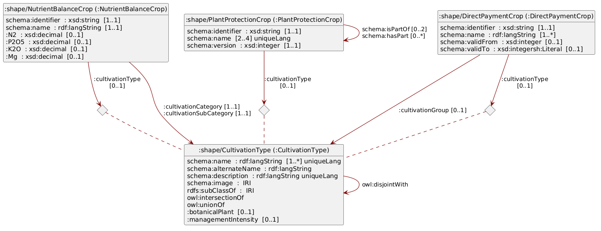

# Hinweis {.unnumbered}

Im vorliegenden Dokument wird bei der Bezeichnung von Personen eine geschlechtsneutrale Formulierung verwendet. Basis bildet der Leitfaden der Bundeskanzlei. Je nach Situation kommen Paarformen (Bürgerinnen und Bürger), geschlechtsabstrakte Formen (versicherte Person), geschlechtsneutrale Formen (Versicherte) oder Umschreibungen ohne Personenbezug zum Einsatz. Das generische Maskulin (Bürger) ist nicht zulässig. Vollformen werden in fortlaufenden Texten verwendet, also in Texten, die aus ausformulierten Sätzen bestehen. In verknappten Textpassagen, namentlich in Tabellen, können Kurzformen verwendet werden. Dabei wird die Kurzform mit Schrägstrich, aber ohne Auslassungsstrich verwendet (Referent/in). Genderstern und ähnliche Schreibweisen werden nicht verwendet.

# Einleitung

Die Definitionen für landwirtschaftliche Kulturen wurden historisch unabhängig voneinander für spezifische gesetzliche Aufträge und Systeme entwickelt. Die fehlende systemübergreifende Harmonisierung (mit einer *Single Source of Truth*) erschwert jedoch die Informationsverarbeitung über jeweilige Systemgrenzen hinaus.

## Was ist eine Kultur?

Der Begriff der landwirtschaftlichen Kultur stützt sich in diesem Hilfsmittel massgeblich auf das Konzept `CultivationType` aus der Vorversion [@eCH-0265:1.0.0].
Eine Kultur definiert sich demnach als Kategorie beziehungsweise als Teil eines Kategorisierungssystems, welches die Art der Nutzung und Kultivierung eines bestimmten Stücks Land über einen definierten Zeitraum beschreibt.

Durch diese Definition ist die landwirtschaftliche Kultur strikt von der botanischen Pflanze abzugrenzen.
Die botanische Systematik klassifiziert biologische Einzelindividuen.
Die landwirtschaftliche Kultur hingegen typisiert keine Individuen, sondern spezifische Formen der Landnutzung.
Es geht bei der Kultur folglich nicht um die biologische Pflanze an sich, sondern um die flächen- und zeitbezogene Bewirtschaftungsform, an welche die jeweiligen agronomischen, rechtlichen oder systemischen Eigenschaften geknüpft sind.

Dieses Hilfsmittel dient dem Verständnis der Kulturbegriffe aus drei unterschiedlichen Bereichen, in welchen Definitionen landwirtschaftlicher Kulturen unabhängig voneinander gemacht wurden:

- [Direktzahlungen](#sec-direct-payments)
- [Nährstoffbilanz](#sec-nutrient-balance)
- [Pflanzenschutz](#sec-plant-protection)

In den folgenden Unterkapiteln werden die Kategorisierungssysteme landwirtschaftlicher Kulturen dieser drei Bereiche im Detail beschrieben.

## Direktzahlungen {#sec-direct-payments}

Im Rahmen des Direktzahlungssystems sind 159 Direktzahlungskulturen (Stand Juli 2026) definiert, welche im Rahmen der Strukturdatenerhebung von den Bewirtschaftenden in den kantonalen Agrarinformationssystemen (KAIS) eingetragen und an das agrarpolitische Informationssystem (AGIS) des Bundes übermittelt werden können.

Direktzahlungskulturen können für keine bis mehrere Beiträge berechtigt sein ([Flächenkatalog und Beitragsberechtigung](https://www.blw.admin.ch/dam/fr/sd-web/QYLa6wGfdK8G/2026%20Merkblatt%20Nr.%206.2%20Fl%C3%A4chenkatalog%20und%20Beitragsberechtigung.pdf)), grundsätzlich müssen sie für die Berechtigung zu Direktzahlungen aber jährlich an AGIS übermittelt werden.
In AGIS stehen also alle aktuell gültigen und historisierten Direktzahlungskulturen und deren Beitragsberechtigungen (keine bis mehrere) für befugte Nutzende (Bund, Kantone) zur Verfügung.
Momentan können diese Daten aber nicht in maschinenlesbarer Form vom AGIS-Webservice bezogen werden.

Die Direktzahlungskulturen kommen nicht nur im Rahmen der Strukturdatenerhebung zum Einsatz, sondern auch bei der gesamtschweizerischen räumlichen Erfassung von Nutzungsflächen.
Die Kantone erfassen diese Geodaten gemäss dem minimalen Geodatenmodell 153.1 «Nutzungsflächen» und stellen die Daten via dem interkantonalen Portal geodienste.ch zur Verfügung (Landwirtschaftliche Kulturflächen).
Die im Rahmen der Geodaten verwendeten Kulturkategorien sind als XML-File auf <https://models.geo.admin.ch> publiziert, wobei weitere (aggregierende) Kulturkategorien definiert wurden und die Attribute nicht zu 100% deckungsgleich sind.

Die Direktzahlungskulturen sind selbst in acht Kulturkategorien eingeteilt (@tbl-directpaymentcrops-categories). Eine mehrheit dieser Kategorien wird explizit in der landwirtschaftlichen Begriffsverordnung (LBV) definiert.

| N  | Name   | Definition | Beispiele     |
|:-  | :----- | :--------- | :------------ |
| 72 | Ackerfläche | [Art. 18 LBV](https://www.fedlex.admin.ch/eli/cc/1999/13/de#art_18) | «Futterweizen gemäss Sortenliste swiss granum», «Winterraps zur Speiseölgewinnung», «Winterraps als nachwachsender Rohstoff» |
| 15 | Dauergrünfläche | [Art. 19 LBV](https://www.fedlex.admin.ch/eli/cc/1999/13/de#art_19) | «Extensiv genutzte Wiesen (ohne Weiden)», «Übrige Grünfläche (Dauergrünfläche), beitragsberechtigt» |
| 27 | Dauerkulturen | [Art. 22 LBV](https://www.fedlex.admin.ch/eli/cc/1999/13/de#art_22) | «Reben», «Obstanlagen (Äpfel)», «Reben (regionsspezifische Biodiversitätsförderfläche)» |
| 14 | Kulturen in ganzjährig geschütztem Anbau | [Art. 14 LBV](https://www.fedlex.admin.ch/eli/cc/1999/13/de#art_14) | «Gemüsekulturen in Gewächshäusern mit festem Fundament», «Übrige Spezialkulturen in geschütztem Anbau ohne festes Fundament» |
| 6  | Weitere Flächen innerhalb der landwirtschaftlichen Nutzfläche | | «Streueflächen innerhalb der landwirtschaftlichen Nutzfläche», «Hecken-, Feld- und Ufergehölze (mit Pufferstreifen) (regionsspezifische Biodiversitätsförderfläche)» |
| 11 | Flächen ausserhalb der landwirtschaftlichen Nutzfläche | | «Wald», «Trockenmauern», «Hausgärten» |
| 5  | Flächen im Sömmerungsgebiet | [Art. 24 LBV](https://www.fedlex.admin.ch/eli/cc/1999/13/de#art_24) | «Sömmerungsweiden», «Artenreiche Grün- und Streueflächen im Sömmerungsgebiet» |
| 9  | Andere Elemente | | «Hochstammfeldobstbäume», «Nussbäume», «Einheimische standortgerechte Einzelbäume und Alleen» |

: Kategorien der Direktzahlungskulturen mit Referenzen auf die landwirtschaftliche Begriffsverordnung (LBV), wo möglich. {#tbl-directpaymentcrops-categories}

## Nährstoffbilanz {#sec-nutrient-balance}

Um umweltbelastende Nährstoffverluste zu reduzieren und die Ertragsfähigkeit der Böden nachhaltig zu sichern, müssen Schweizer Landwirtschaftsbetriebe eine ausgeglichene Nährstoffbilanz ausweisen [@grud2017].
Das zentrale Berechnungsinstrument hierfür ist die Suisse-Bilanz, welche den Nährstoffanfall (etwa durch Hofdünger) und den Nährstoffbedarf auf Betriebsebene systematisch gegenüberstellt [@suibi2025].
Für diese Bilanzierung wurden spezifische Kulturen definiert, weil jede landwirtschaftliche Kultur einen anderen, normierten Nährstoffbedarf (z.B. für Stickstoff oder Phosphor) aufweist [@grud2017].
Die Zuweisung dieser Kulturen ist die Grundvoraussetzung, um eine Nährstoffbilanz für einen Betrieb berechnen zu können.

Um die Suisse-Bilanz zu berechnen, ist die «Wegleitung Suisse-Bilanz» entscheidend, welche von Agridea und dem Bundesamt für Landwirtschaft herausgegeben wird [@suibi2025].
In dem Dokument sind viele Referenztabellen enthalten, die entsprechend nach Kulturen aufgegliedert sind, abgeleitet von den detaillierteren Tabellen in @grud2017.

Zur Standardisierung der Suisse-Bilanz-Berechnung stellt das Bundesamt für Landwirtschaft neu den Nährstoffbilanz-Berechnungsservice (NBBS) als RESTful API zur Verfügung.
Über diese Schnittstelle lässt sich unter anderem ein Katalog der landwirtschaftlichen Kulturen abrufen.[^3]
Der NBBS ordnet die Kulturen in einer strikten, dreistufigen Hierarchie (@tbl-nbbs-hierarchy).

[^3]: Die «agronomischen Kulturkategorien» für den Nährstoffbilanzrechner sind beispielsweise über den Endpoint <https://rf-vp.agate.ch/digiflux/naebi/2-0/naebiservice-backend/agronomiccropcategories> abrufbar. Mittels der Slugs `cultivationcategories` und `cultivationsubcategories` lassen sich zudem die jeweiligen Übergruppen abfragen.

| N | Name     | Beschreibung                                         | Beispiele                      |
|:--|:---------|:-----------------------------------------------------|:-------------------------------|
| 3      | Kultivierungskategorien (`cultivationcategories`) | Oberste Hierarchieebene, dient nur der Strukturierung. | Ackerkulturen, Grundfutterproduktion, Spezialkulturen |
| 8      | Kultivierungsunterkategorien (`cultivationsubcategories`) | Mittlere Ebene, dient ebenfalls nur der Strukturierung. | Getreide, Dauerkulturen, Hackfrüchte, Freilandgemüse, geschützte Kulturen, Grundfutter, übriger Ökoausgleich, diverse Kulturen |
| 314    | Agronomische Kulturkategorien (`agronomiccropcategories`) | Unterste Ebene, welche die eigentlichen Kulturen beinhaltet. Hier sind die spezifischen agronomischen und regulatorische Eigenschaften hinterlegt. | «Winterweizen», «Zuckerrüben», «Naturwiese extensiv», «Aubergine, Erdkultur (geschützter Anbau)», «Walnüsse ≥ 185 Bäume/ha» |

: Hierarchische Struktur der Kulturen im Nährstoffbilanz-Berechnungsservice und Anzahl der Elemente (N) je Klasse, Stand Juli 2026. {#tbl-nbbs-hierarchy}

Während die beiden obersten Ebenen rein der Strukturierung und Gruppierung dienen, weisen die agronomischen Kulturkategorien auf der untersten Ebene spezifische agronomische und regulatorische Eigenschaften auf.
Dazu gehören beispielsweise der Ertrag, die Zulässigkeit für bestimmte Direktzahlungsprogramme oder die Teilnahme an spezifischen Vorhaben wie dem «62a Nitrat-Projekt».

## Pflanzenschutz {#sec-plant-protection}

Das [Pflanzenschutzmittelverzeichnis (PSMV)](https://www.psm.admin.ch/) ist das offizielle Register des Bundes, das alle in der Schweiz zugelassenen Pflanzenschutzmittel auflistet und verbindlich regelt, für welche Kulturen und unter welchen Bedingungen diese rechtmässig eingesetzt werden dürfen.
Es wird vom Bundesamt für Lebensmittelsicherheit und Veterinärwesen (BLV) gepflegt und umfasst 321 definierte Kulturen.
Die Bezeichnungen dieser Kulturen liegen mehrsprachig auf Deutsch, Französisch und Italienisch sowie teilweise auf Englisch vor.

Anders als die streng monohierarchische Klassifikationen (wie in AGIS und im NBBS) sind die Kulturen im PSMV als Objekte in einer flexiblen Polyhierarchie modelliert.
Dies bedeutet, dass ein Element mehr als ein Überelement aufweisen kann, welches wiederum eigenen Überelementen untergeordnet ist. 

Diese Struktur wurde ursprünglich von der [*European Plant Protection Organization* (EPPO)](https://eppo.int/) abgeleitet, anschliessend aber für die spezifischen Schweizer Anforderungen weiter modifiziert.
Die Organisation in Übergruppen erlaubt eine äusserst flexible Modellierung:
Gewisse Äste der Hierarchie sind flach, während andere sehr tief verschachtelt sein können.
Eine Kultur kann dabei bis zu zwei direkte Übergruppen besitzen.
So ist beispielsweise die *Sommergerste* sowohl der Übergruppe «Gerste» als auch dem «Sommergetreide» untergeordnet.

Die Hierarchietiefe kann bis zu fünf Übergruppen umfassen, wie folgendes Beispiel aus dem Gemüsebau verdeutlicht:

1. **Schnittsalat**, gehört zu
2. **Blattsalate (Asteraceae)**, gehört zu
3. **Lactuca-Salate**, gehört zu
4. **Salate (Asteraceae)**, gehört zu
5. **Korbblütler (Asteraceae)**, gehört zu
6. **Gemüsebau allg.**

Die präzise Abbildung dieser Hierarchie ist fachlich von grosser Bedeutung, da die Zulassungslogik direkt in die Struktur des PSMV eingebaut ist.
Wenn eine Pflanzenschutzmittel-Anwendung für eine übergeordnete Kulturgruppe bewilligt ist, gilt diese Bewilligung automatisch auch für sämtliche untergeordneten Kulturen.

Ein Beispiel hierfür:
Das Herbizid [«Ariane C»](https://www.psm.admin.ch/de/produkte/7430) ist gegen ein- und mehrjährige Dicotyledonen in Getreiden einsetzbar.
Damit ist es bei allen Kulturen anwendbar, welche vom PSMV als Getreide klassifiziert werden.
Mais gehört in diesem System aber explizit nicht zu den Getreiden – in der Systematik des NBBS aber schon.
Die korrekte Nachbildung dieser Polyhierarchie ist in den Daten folglich essenziell, um Zulassungen maschinell korrekt zu verarbeiten.

# Datenmodell

## Nutzung von Semantic-Web-Technologien

Im Gegensatz zum Pflanzenschutzmittelverzeichnis wird beim Nährstoffbilanzrechner Mais als Getreide gezählt – es existieren also verschiedene Definitionen von Getreide.
Um diese eindeutig kennzeichnen zu können, setzen wir auf Linked Data.
Für weiterführende Informationen zur Publikation, Nutzung und den Kernprozessen von vernetzten Daten verweisen wir auf @eCH-0205:1.0.0.

Das konsolidierte Datenmodell wird durch eine RDFS-Ontologie abgebildet und mittels SHACL-Shapes validiert [@rdf;@owl2;@shacl].

TBC.

# Klassen



# Nutzung der Daten

- Sämtliche hier beschriebenen Daten können auf LINDAS bezogen werden.
- Knappe Anleitung zum Beziehen der Daten.

# Sicherheitsaspekte

Informationen zu den ausdrücklich massgeblichen rechtlichen Grundlagen oder ein Hinweis darauf, dass bei der Umsetzung die entsprechenden rechtlichen Grundlagen zu beachten sind.

# Haftungsausschluss

eCH-Standards, die der Verein eCH dem Anwender kostenlos zur Verfügung stellt oder die auf eCH verweisen, haben nur den Status von Empfehlungen.
Der Verein eCH haftet in keinem Fall für Entscheidungen oder Massnahmen, die der Anwender auf der Grundlage dieser Dokumente trifft bzw. ergreift.
Der Anwender ist dafür verantwortlich, die Dokumente vor ihrer Verwendung selbst zu überprüfen und gegebenenfalls fachlichen Rat einzuholen.
eCH-Standards können und sollen die technische, organisatorische oder rechtliche Beratung im Einzelfall nicht ersetzen.

Dokumente, Verfahren, Methoden, Produkte und Standards, auf die in eCH-Standards verwiesen wird, sind möglicherweise durch Marken-, Urheber- oder Patentrechte geschützt.
Es liegt in der ausschliesslichen Verantwortung des Anwenders, die erforderlichen Lizenzen von den berechtigten Personen und/oder Organisationen einzuholen.

Obwohl der Verein eCH bei der Erstellung der eCH-Standards mit angemessener Sorgfalt vorgegangen ist, kann er keine Gewährleistung oder Garantie dafür übernehmen, dass die bereitgestellten Informationen und Dokumente aktuell, vollständig, richtig oder fehlerfrei sind.
eCH behält sich das Recht vor, die Inhalte der eCH-Standards jederzeit und ohne vorherige Ankündigung zu ändern.

Jede Haftung für Schäden, die durch die Nutzung der eCH-Standards durch den Anwender entstehen, wird im gesetzlich zulässigen Rahmen ausgeschlossen.

# Urheberrechte

Personen, die eCH-Standards erarbeiten, bleiben Inhaber ihrer geistigen Eigentumsrechte.
Diese Personen verpflichten sich jedoch, ihre geistigen Eigentumsrechte oder andere Rechte an geistigen Eigentumsrechten Dritter, soweit möglich, den jeweiligen Fachgruppen und dem Verein eCH kostenlos und zur uneingeschränkten Nutzung und Weiterentwicklung im Rahmen des Vereinszwecks zur Verfügung zu stellen.

Die von den Fachgruppen erarbeiteten Standards dürfen unter Nennung des jeweiligen Autors von eCH kostenlos und in uneingeschränktem Umfang genutzt, verbreitet und weiterentwickelt werden.

eCH-Standards sind vollständig dokumentiert und frei von lizenz- und/oder patentrechtlichen Einschränkungen. Die dazugehörige Dokumentation kann kostenlos angefordert werden.
Diese Bestimmungen gelten jedoch nur für die von eCH erarbeiteten Standards, nicht aber für Standards oder Produkte Dritter, die auf eCH-Standards verweisen.
Die Standards enthalten die entsprechenden Hinweise auf Rechte Dritter.

# Anhang A - Referenzen {.appendix}

::: {#refs}
:::

# Anhang B - Mitwirkung und Prüfung {.appendix}

| Name                           | Organisation                      |
|:-------------------------------|:----------------------------------|
| Marc Beringer                  | Bundesamt für Landwirtschaft      |
| Damian Oswald                  | Bundesamt für Landwirtschaft      |
| Lea Stauber                    | Bundesamt für Landwirtschaft      |
| Christian Wilda                | Bundesamt für Landwirtschaft      |

: Autoren und Revision {#tbl-authors}

# Anhang C - Abkürzungen und Glossar {.appendix}

| Abkürzung          | Beschreibung                                  |
|:-------------------|:----------------------------------------------|
| AGIS               | Agrarpolitisches Informationssystem           |
| KAIS               | Kantonales Agrarinformationssystem            |
| NBBS               | Nährstoffbilanz-Berechnungsservice            |

: Abkürzungsverzeichnis {#tbl-abbreviations}

# Anhang D - Änderungen gegenüber der Vorversion {.appendix}

Das vorliegende Dokument ist ein Hilfsmittel zur harmonisierten, systemübergreifenden Nutzung von landwirtschaftlichen Kulturdaten in der Schweiz. 
Gegenüber der Version 1.1.0 (eCH-0265 Datenstandard Agrardaten – Flächen und Kulturen) wurde das Dokument von einem unverbindlichen Standard zu einem Hilfsmittel umgewandelt.
Gleichzeitig wurde der inhaltliche Fokus geschärft:
Klassen rund um Geometrien/Flächen[^1], Sorten sowie Direktzahlungsprogrammen sind nicht mehr Teil dieses Dokuments[^2].
Neu enthalten sind dafür die Kulturen aus dem Pflanzenschutzmittelverzeichnis.

[^1]: Die Erhebung von landwirtschaftlichen Nutzflächen wird bereits mit dem minimale Geodatenmodell «Landwirtschaftliche Kulturflächen» (Identifikator 153) spezifiziert: <https://www.blw.admin.ch/de/landwirtschaftliche-kulturflaechen>

[^2]: Eine spätere Wiederaufnahme von Sorten und Programmen bleibt vorbehalten.

Eine vollständige Übersicht der Veränderungen wird auf GitHub geführt: <https://github.com/blw-ofag-ufag/eCH-0265/releases>.

# Anhang E - Abbildungsverzeichnis {.appendix}

# Anhang F - Tabellenverzeichnis {.appendix}