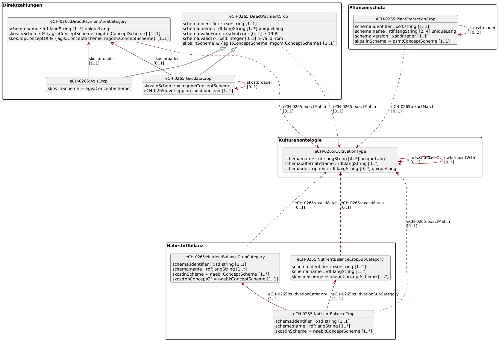

# Hinweis {#sec-note .unnumbered}

Im vorliegenden Dokument wird bei der Bezeichnung von Personen eine geschlechtsneutrale Formulierung verwendet.
Basis bildet der Leitfaden der Bundeskanzlei.
Je nach Situation kommen Paarformen (Bürgerinnen und Bürger), geschlechtsabstrakte Formen (versicherte Person), geschlechtsneutrale Formen (Versicherte) oder Umschreibungen ohne Personenbezug zum Einsatz.
Das generische Maskulin (Bürger) ist nicht zulässig.
Vollformen werden in fortlaufenden Texten verwendet, also in Texten, die aus ausformulierten Sätzen bestehen.
In verknappten Textpassagen, namentlich in Tabellen, können Kurzformen verwendet werden.
Dabei wird die Kurzform mit Schrägstrich, aber ohne Auslassungsstrich verwendet (Referent/in).
Genderstern und ähnliche Schreibweisen werden nicht verwendet.

# Einleitung {#sec-introduction}

Die Definitionen für landwirtschaftliche Kulturen wurden historisch unabhängig voneinander für spezifische gesetzliche Aufträge und Systeme entwickelt.
Die fehlende systemübergreifende Harmonisierung (mit einer *Single Source of Truth*) erschwert jedoch die Informationsverarbeitung über jeweilige Systemgrenzen hinaus.

Das vorliegende Hilfsmittel formuliert keine Vorgaben, sondern unterstützt gezielt die reibungslose Datenintegration über verschiedene Fachbereiche und Organisationen hinweg.
Zu diesem Zweck stehen fertige Kulturentabellen sowie die dazugehörigen Mapping-Tabellen zur Verfügung.
Alle definierten Ressourcen sind als *Linked Data* modelliert und lassen sich vollständig automatisiert beziehen, was eine effiziente Überführung von Daten aus einem System in ein anderes ermöglicht.

## Was ist eine Kultur? {#sec-what-is-a-crop}

Der Begriff der landwirtschaftlichen Kultur stützt sich in diesem Hilfsmittel massgeblich auf das Konzept `CultivationType` aus der Vorversion [@eCH-0265:1.0.0].
Eine Kultur definiert sich demnach als Kategorie beziehungsweise als Teil eines Kategorisierungssystems, welches die Art der Nutzung und Kultivierung eines bestimmten Stücks Land über einen definierten Zeitraum beschreibt.

Durch diese Definition ist die landwirtschaftliche Kultur strikt von der botanischen Taxonomie abzugrenzen.
Die botanische Systematik klassifiziert einzelne Pflanzen.
Die landwirtschaftliche Kultur hingegen typisiert keine Individuen, sondern spezifische Formen der Landnutzung.
Es geht bei der Kultur folglich nicht um die biologische Pflanze an sich, sondern um die flächen- und zeitbezogene Bewirtschaftungsform, an welche die jeweiligen agronomischen, rechtlichen oder systemischen Eigenschaften geknüpft sind.

Dieses Hilfsmittel dient dem Verständnis der Kulturbegriffe aus drei unterschiedlichen Bereichen, in welchen Definitionen landwirtschaftlicher Kulturen unabhängig voneinander gemacht wurden:

- [Direktzahlungen](#sec-direct-payments)
- [Nährstoffbilanz](#sec-nutrient-balance)
- [Pflanzenschutz](#sec-plant-protection)

In den folgenden Unterkapiteln werden die Kategorisierungssysteme landwirtschaftlicher Kulturen dieser drei Bereiche im Detail beschrieben.

## Direktzahlungen {#sec-direct-payments}

Im Rahmen des Direktzahlungssystems sind 159 Direktzahlungskulturen (Stand Juli 2026) definiert, die je über einen Kulturcode (auch LNF-Code) identifiziert werden.
Alle Kulturen mit Kulturcode müssen jährlich erfasst werden -- unabhängig davon, ob sie für Beiträge berechtigt sind oder nicht (vgl. [Flächenkatalog und Beitragsberechtigung](https://www.blw.admin.ch/dam/fr/sd-web/QYLa6wGfdK8G/2026%20Merkblatt%20Nr.%206.2%20Fl%C3%A4chenkatalog%20und%20Beitragsberechtigung.pdf)).

Die Direktzahlungskulturen werden in zwei Systemen geführt: in der Strukturdatenerhebung (AGIS) und in den Geodaten der landwirtschaftlichen Kulturflächen (MGDM).
Die exakten Definitionen und die exakten Kulturen sind dabei nicht zu 100% identisch.
In diesem Hilfsmittel sind sie deshalb zweimal abgebildet.
Die gemeinsamen Eigenschaften (Identifikator, Name, Nutzungstyp und zeitliche Gültigkeit) definiert die Oberklasse `eCH-0265:DirectPaymentCrop`; je eine Unterklasse beschreibt die systemspezifischen Ergänzungen (siehe @sec-classes).

### Strukturdatenerhebung (AGIS) {#sec-direct-payments-agis}

Im Rahmen der Strukturdatenerhebung tragen die Bewirtschaftenden ihre Kulturen in den kantonalen Agrarinformationssystemen (KAIS) ein, von wo sie an das agrarpolitische Informationssystem (AGIS) des Bundes übermittelt werden.
In AGIS stehen damit alle aktuell gültigen und historisierten Direktzahlungskulturen und deren Beitragsberechtigungen für Bund und Kantone zur Verfügung.
Momentan können diese Daten aber nicht in maschinenlesbarer Form vom AGIS-Webservice bezogen werden.

Die AGIS-Kulturen sind als Klasse `eCH-0265:AgisCrop` im Konzeptschema `agis:ConceptScheme` modelliert.
Sie sind in acht Kulturkategorien eingeteilt (@tbl-directpaymentcrops-categories), von denen eine Mehrheit explizit in der landwirtschaftlichen Begriffsverordnung (LBV) definiert wird.

| N  | Kategorie | Definition | Beispiele     |
|:-  | :----- | :--------- | :------------ |
| 72 | Ackerfläche | [Art. 18 LBV](https://www.fedlex.admin.ch/eli/cc/1999/13/de#art_18) | «Futterweizen gemäss Sortenliste swiss granum», «Winterraps zur Speiseölgewinnung», «Winterraps als nachwachsender Rohstoff» |
| 15 | Dauergrünfläche | [Art. 19 LBV](https://www.fedlex.admin.ch/eli/cc/1999/13/de#art_19) | «Extensiv genutzte Wiesen (ohne Weiden)», «Übrige Grünfläche (Dauergrünfläche), beitragsberechtigt» |
| 27 | Dauerkulturen | [Art. 22 LBV](https://www.fedlex.admin.ch/eli/cc/1999/13/de#art_22) | «Reben», «Obstanlagen (Äpfel)», «Reben (regionsspezifische Biodiversitätsförderfläche)» |
| 14 | Kulturen in ganzjährig geschütztem Anbau | [Art. 14 Abs. 1 Bst. e LBV](https://www.fedlex.admin.ch/eli/cc/1999/13/de#art_14) | «Gemüsekulturen in Gewächshäusern mit festem Fundament», «Übrige Spezialkulturen in geschütztem Anbau ohne festes Fundament» |
| 6  | Weitere Flächen innerhalb der landwirtschaftlichen Nutzfläche | | «Streueflächen innerhalb der landwirtschaftlichen Nutzfläche», «Hecken-, Feld- und Ufergehölze (mit Pufferstreifen) (regionsspezifische Biodiversitätsförderfläche)» |
| 11 | Flächen ausserhalb der landwirtschaftlichen Nutzfläche | | «Wald», «Trockenmauern», «Hausgärten» |
| 5  | Flächen im Sömmerungsgebiet | [Art. 24 LBV](https://www.fedlex.admin.ch/eli/cc/1999/13/de#art_24) | «Sömmerungsweiden», «Artenreiche Grün- und Streueflächen im Sömmerungsgebiet» |
| 9  | Andere Elemente | | «Hochstammfeldobstbäume», «Nussbäume», «Einheimische standortgerechte Einzelbäume und Alleen» |

: Anzahl Direktzahlungskulturen (N) je Kulturkategorie (Kategorie) mit Referenzen auf die geltende Definition in der landwirtschaftlichen Begriffsverordnung (LBV), wo möglich. {#tbl-directpaymentcrops-categories tbl-colwidths="[5,35,20,40]"}

### Geodaten (MGDM 153.1) {#sec-direct-payments-mgdm}

Die Kantone erfassen die landwirtschaftlichen Nutzungsflächen zudem geometrisch gemäss dem minimalen Geodatenmodell «Landwirtschaftliche Kulturflächen» (Identifikator 153, Modell 153.1 «Nutzungsflächen») und stellen die Daten über das interkantonale Portal [geodienste.ch](https://geodienste.ch/) zur Verfügung (siehe [«landwirtschaftliche Kulturflächen»](https://www.blw.admin.ch/de/landwirtschaftliche-kulturflaechen)).
Der dabei verwendete Katalog der Nutzungsarten (`LNF_Katalog_Nutzungsart`) ist als INTERLIS-Katalog auf <https://models.geo.admin.ch/BLW/> publiziert.
Er baut auf den Direktzahlungskulturen auf, enthält jedoch zusätzliche aggregierende Nutzungsarten, eine eigene, auf das Geodatenmodell bezogene zeitliche Gültigkeit sowie das Attribut, ob eine Nutzung überlagernd erfasst wird.

Die Nutzungsarten sind als Klasse `eCH-0265:GeodataCrop` im Konzeptschema `mgdm:ConceptScheme` modelliert.
Sie sind 13 Hauptkategorien zugeordnet; überlagernd erfasste Nutzungsarten (z.B. Bäume) haben keine Hauptkategorie.
Die sieben aggregierenden Nutzungsarten (z.B. LNF-Code 730 «Obstanlagen aggregiert») fassen Nutzungsarten derselben Hauptkategorie mit gleicher Beitragsberechtigung und überschneidendem Gültigkeitszeitraum zusammen und sind diesen im Konzeptschema übergeordnet: eine zusammengefasste Nutzungsart zeigt mit `skos:broader` auf ihre aggregierende Nutzungsart, diese wiederum auf die Hauptkategorie, welche sich damit über `skos:broaderTransitive` ergibt.
Diese Zuordnung ist abgeleitet, da der Katalog sie nicht führt: das Attribut `Ist_Aggregiert` wurde mit der Modellversion 2.0 entfernt und bezeichnete ohnehin nur die aggregierenden Codes selbst, nie deren Mitglieder.

## Nährstoffbilanz {#sec-nutrient-balance}

Um umweltbelastende Nährstoffverluste zu reduzieren und die Ertragsfähigkeit der Böden nachhaltig zu sichern, müssen Schweizer Landwirtschaftsbetriebe eine ausgeglichene Nährstoffbilanz ausweisen [@grud2017].
Das zentrale Berechnungsinstrument hierfür ist die Suisse-Bilanz, welche den Nährstoffanfall (etwa durch Hofdünger) und den Nährstoffbedarf auf Betriebsebene systematisch gegenüberstellt [@suibi2025].
Für diese Bilanzierung wurden spezifische Kulturen definiert, weil jede landwirtschaftliche Kultur einen anderen, normierten Nährstoffbedarf (z.B. für Stickstoff oder Phosphor) aufweist [@grud2017].
Die Zuweisung dieser Kulturen ist die Grundvoraussetzung, um eine Nährstoffbilanz für einen Betrieb berechnen zu können.

Um die Suisse-Bilanz zu berechnen, ist die «Wegleitung Suisse-Bilanz» entscheidend, welche von Agridea und dem Bundesamt für Landwirtschaft herausgegeben wird [@suibi2025].
In dem Dokument sind viele Referenztabellen enthalten, die entsprechend nach Kulturen aufgegliedert sind, abgeleitet von den detaillierteren Tabellen in @grud2017.

Zur Standardisierung der Suisse-Bilanz-Berechnung stellt das Bundesamt für Landwirtschaft neu den Nährstoffbilanz-Berechnungsservice (NBBS) als RESTful API zur Verfügung.
Über diese Schnittstelle lässt sich unter anderem ein Katalog der landwirtschaftlichen Kulturen abrufen.[^3]
Der NBBS ordnet die Kulturen in einer strikten, dreistufigen Hierarchie (@tbl-nbbs-hierarchy).

[^3]: Die «agronomischen Kulturkategorien» für den Nährstoffbilanzrechner sind beispielsweise über den Endpoint <https://rf-vp.agate.ch/digiflux/naebi/2-0/naebiservice-backend/agronomiccropcategories> abrufbar.
  Mittels der Slugs `cultivationcategories` und `cultivationsubcategories` lassen sich zudem die jeweiligen Übergruppen abfragen.

| N | Name     | Beschreibung                                         | Beispiele                      |
|:--|:---------|:-----------------------------------------------------|:-------------------------------|
| 3      | Kultivierungskategorien (`cultivationcategories`) | Oberste Hierarchieebene, dient nur der Strukturierung. | Ackerkulturen, Grundfutterproduktion, Spezialkulturen |
| 8      | Kultivierungsunterkategorien (`cultivationsubcategories`) | Mittlere Ebene, dient ebenfalls nur der Strukturierung. | Getreide, Dauerkulturen, Hackfrüchte, Freilandgemüse, geschützte Kulturen, Grundfutter, übriger Ökoausgleich, diverse Kulturen |
| 314    | Agronomische Kulturkategorien (`agronomiccropcategories`) | Unterste Ebene, welche die eigentlichen Kulturen beinhaltet. Hier sind die spezifischen agronomischen und regulatorische Eigenschaften hinterlegt. | «Winterweizen», «Zuckerrüben», «Naturwiese extensiv», «Aubergine, Erdkultur (geschützter Anbau)», «Walnüsse ≥ 185 Bäume/ha» |

: Hierarchische Struktur der Kulturen im Nährstoffbilanz-Berechnungsservice und Anzahl der Elemente (N) je Klasse, Stand Juli 2026. {#tbl-nbbs-hierarchy tbl-colwidths="[5,30,35,30]"}

Während die beiden obersten Ebenen rein der Strukturierung und Gruppierung dienen, weisen die agronomischen Kulturkategorien auf der untersten Ebene spezifische agronomische und regulatorische Eigenschaften auf.
Dazu gehören beispielsweise der Ertrag, die Zulässigkeit für bestimmte Direktzahlungsprogramme oder die Teilnahme an spezifischen Vorhaben wie dem «62a Nitrat-Projekt».

## Pflanzenschutz {#sec-plant-protection}

Das [Pflanzenschutzmittelverzeichnis (PSMV)](https://www.psm.admin.ch/) ist das offizielle Register des Bundes, das alle in der Schweiz zugelassenen Pflanzenschutzmittel auflistet.
Es regelt, für welche Kulturen und unter welchen Bedingungen diese rechtmässig eingesetzt werden dürfen.
Es wird vom Bundesamt für Lebensmittelsicherheit und Veterinärwesen (BLV) gepflegt und umfasst 321 definierte Kulturen.
Die Bezeichnungen dieser Kulturen liegen mehrsprachig auf Deutsch, Französisch und Italienisch sowie teilweise auf Englisch vor.

Anders als die streng monohierarchische Klassifikationen (wie in AGIS und im NBBS) sind die Kulturen im PSMV als Objekte in einer flexiblen Polyhierarchie modelliert.
Dies bedeutet, dass ein Element mehr als ein Überelement aufweisen kann, welches wiederum eigenen Überelementen untergeordnet ist.

Diese Struktur wurde ursprünglich von der [*European Plant Protection Organization* (EPPO)](https://eppo.int/) abgeleitet, anschliessend aber für die spezifischen Schweizer Anforderungen weiter modifiziert.
Die Organisation in Übergruppen erlaubt eine äusserst flexible Modellierung:
Gewisse Äste der Hierarchie sind flach, während andere sehr tief verschachtelt sein können.
Eine Kultur kann dabei bis zu zwei direkte Übergruppen besitzen.
So ist beispielsweise die *Sommergerste* sowohl der Übergruppe «Gerste» als auch dem «Sommergetreide» untergeordnet.

Die Hierarchietiefe kann bis zu fünf Übergruppen umfassen, wie folgendes Beispiel aus dem Gemüsebau verdeutlicht:

1. **Schnittsalat**, gehört zu
2. **Blattsalate (Asteraceae)**, gehört zu
3. **Lactuca-Salate**, gehört zu
4. **Salate (Asteraceae)**, gehört zu
5. **Korbblütler (Asteraceae)**, gehört zu
6. **Gemüsebau allg.**

Die präzise Abbildung dieser Hierarchie ist fachlich von grosser Bedeutung, da die Zulassungslogik direkt in die Struktur des PSMV eingebaut ist.
Wenn eine Pflanzenschutzmittel-Anwendung für eine übergeordnete Kulturgruppe bewilligt ist, gilt diese Bewilligung automatisch auch für sämtliche untergeordneten Kulturen.

Ein Beispiel hierfür:
Das Herbizid [«Ariane C»](https://www.psm.admin.ch/de/produkte/7430) darf gegen «ein- und mehrjährige Dicotyledonen» in «Getreiden» eingesetzt werden.
Damit darf es auf alle Kulturen angewendet, welche vom PSMV als Getreide klassifiziert sind.
Mais, Buchweizen und Quinoa gehört in diesem System aber explizit nicht zu den Getreiden – in der Systematik des NBBS aber schon.[^4]
Die korrekte Nachbildung dieser Polyhierarchie ist in den Daten folglich essenziell, um Zulassungen maschinell korrekt zu verarbeiten.

[^4]: Botanisch gesehen ist Mais ein Getreide (Süssgras), unterscheidet sich in der ackerbaulichen Praxis als Hackfrucht jedoch merklich von klassischen Getreidearten.
  Buchweizen (ein Knöterichgewächs) und Quinoa (ein Fuchsschwanzgewächs) sind botanisch nicht mit Getreide (Süssgras) verwandt.
  Ihr Erntegut und dessen Verwendung ähneln jedoch stark denen von echtem Getreide, daher werden sie manchmal als Pseudogetreide bezeichnet.

# Datenmodell {#sec-data-model}

## Nutzung von Semantic-Web-Technologien {#sec-linked-data}

Im Gegensatz zum Pflanzenschutzmittelverzeichnis wird beim Nährstoffbilanzrechner Mais als Getreide gezählt – es existieren also verschiedene Definitionen von Getreide.
Um diese eindeutig kennzeichnen zu können, setzen wir auf Linked Data.
Für weiterführende Informationen zur Publikation, Nutzung und den Kernprozessen von vernetzten Daten verweisen wir auf @eCH-0205:1.0.0.

Das konsolidierte Datenmodell wird durch eine RDFS-Ontologie abgebildet und mittels SHACL-Shapes validiert [@rdf;@owl2;@shacl].

{#fig-uml width="100%" .lightbox}

@fig-uml veranschaulicht die grundlegende Architektur des semantischen Modells: Im Zentrum steht eine generische Referenzklasse (`eCH-0265:CultivationType`).
Die Kulturhierarchien der drei Bereiche (Direktzahlungen, Nährstoffbilanz und Pflanzenschutz) sind jeweils als SKOS-Konzeptschema modelliert; im Bereich Direktzahlungen sind es zwei, eines für die Strukturdatenerhebung (AGIS) und eines für das Geodatenmodell (MGDM).
Jede Kultur kann dabei auf die zentrale Referenzklasse "zeigen".
Dieser modulare Aufbau erlaubt es, die historisch gewachsenen, in sich geschlossenen Kategoriensysteme unter Beibehaltung ihrer spezifischen fachlichen und rechtlichen Eigenschaften in einem gemeinsamen Graphen abzubilden und trotzdem miteinander zu verknüpfen.

# Klassen {#sec-classes}



# Instruktionen zur Datenintegration {#sec-data-retrieval}

Die diesem Dokument zugrundeliegenden Master- und Referenzdaten sind als _Linked Data_ verfügbar.

Die technologische Basis dafür bildet das [Resource Description Framework (RDF)](https://www.w3.org/TR/rdf11-concepts/), ein zentraler Standard des World Wide Web Consortiums (W3C) zur Modellierung von Datenstrukturen im Web.
In RDF werden Informationen nicht in klassischen Tabellen, sondern als vernetzte Graphen abgebildet.
Jede Aussage besteht dabei aus einem sogenannten Triple (Subjekt, Prädikat, Objekt).
Diese Struktur ermöglicht eine maschinenlesbare, interoperable und systemübergreifend eindeutige Beschreibung von Ressourcen und deren Relationen zueinander.

Für die Speicherung und Publikation dieser RDF-Daten wird [LINDAS](https://lindas.admin.ch/) (Linked Data Service) genutzt, der offizielle Linked-Data-Dienst der Schweizer Bundesverwaltung.
LINDAS fungiert als sogenannter _Triple Store_, einer spezialisierte Graphdatenbank, die für das effiziente Speichern und Abfragen von RDF-Triples optimiert ist und die Daten öffentlich über eine genormte Schnittstelle bereitstellt.

Das folgende Kapitel gibt eine minimale Anleitung, wie die Daten von LINDAS abgefragt und bezogen werden können.

## Bezug der Stammdaten über LINDAS {#sec-lindas-data-integration}

Die Kulturenstammdaten können als Linked Data mittels der Abfragesprache [SPARQL 1.1 Query Language](https://www.w3.org/TR/sparql11-query/) direkt aus dem LINDAS-Triplestore bezogen werden.
Das nachfolgende generische Beispiel zeigt eine einfache Abfrage, welche sämtliche Nutzungstypen mit deren deutschem Namen zurückgibt:

``` rq

```

Auf <https://lindas.admin.ch/sparql/> können solche Abfragen manuell über eine graphische Benutzeroberfläche ausgeführt werden.

Weitere praxisnahe Abfragebeispiele stehen im [GitHub Repository unter src/sparql/queries](https://github.com/blw-ofag-ufag/eCH-0265/tree/main/src/sparql/queries) zur Verfügung.

Für den automatisierten Datenabruf und die Systemintegration kann der LINDAS-Endpunkt über einen HTTP-POST-Request angesprochen werden.
Dabei wird die SPARQL-Abfrage direkt im Body der Anfrage übermittelt.
Ein entsprechendes Aufrufbeispiel mit `curl` sieht folgendermassen aus:

``` sh
curl -X POST "https://lindas.admin.ch/query" \
     -H "Content-Type: application/sparql-query" \
     -H "Accept: application/sparql-results+json" \
     --data-binary @query.rq -o data.json
```

Dieser Aufruf setzt voraus, dass eine gültige SPARQL-Abfrage in der lokalen Datei `query.rq` vorliegt.
Je nach Anforderung lässt sich das Rückgabeformat über den `Accept`-Header steuern.
Für `SELECT`-Abfragen unterstützt LINDAS standardmässig strukturierte Formate wie JSON (`application/sparql-results+json`), XML (`application/sparql-results+xml`) und CSV (`text/csv`).

## Bezug von Mapping-Tabellen {#sec-mapping-tables}

Um die Beziehungen zwischen den Kulturen der unterschiedlichen Systeme aufzuzeigen, werden Mapping-Tabellen bereitgestellt. Diese dienen als «Übersetzung» zwischen dem Direktzahlungssystem (AGIS), dem Nährstoffbilanz-Berechnungsservice (NAEBI) und dem Pflanzenschutzmittelverzeichnis (PSM). 

Die Relationen der Kulturen zueinander werden durch Beziehungen des *Simple Knowledge Organization System* (SKOS) klassifiziert:

- `skos:exactMatch`: Verknüpft zwei Konzepte (d.h. Kulturen aus zwei Systemen) bei denen genau dasselbe gemeint ist.
- `skos:narrowMatch` und `skos:broadMatch`: Beschreiben eine hierarchische Zuordnung zwischen zwei Konzepten, wobei die beiden Beziehungen zueinander invers sind.

| Quellsystem | Kultur Quellsystem | SKOS-Beziehung | Zielsystem | Kultur Zielsystem | Anmerkung |
| :--- | :--- | :--- | :--- | :--- | :--- |
| AGIS | Sommergerste | `skos:exactMatch` | NAEBI | Sommergerste | Die Kulturen im Quell- und Zielsystem sind synonym. |
| AGIS | Wintergerste | `skos:narrowMatch` | NAEBI | Wintergerste in 62a Nitrat-Projekt | Die Kultur im Zielsystem ist spezifischer als jene im Quellsystem. |
| AGIS | Emmer, Einkorn | `skos:broadMatch` | PSM | Getreide | Die Kultur im Quellsystem ist spezifischer als jene im Zielsystem. |

: Beispiele der Mapping-Relationen {#tbl-mapping-example}

Die Prädikate `skos:exactMatch`, `skos:narrowMatch` und `skos:broadMatch` werden im Verarbeitungsprozess direkt an die Kulturen im Graphen angehängt und sind auf LINDAS abfragbar. Die Generierung erfolgt über das SPARQL-Skript `src/sparql/processing/02_mapping_table_skos_generation.rq` mittels `INSERT`-Befehlen.

::: {.callout-note}
Im Datenverarbeitungsprozess werden hierarchische Prädikate (`narrowMatch`, `broadMatch`) nur dann generiert, wenn für eine Kultur aus einem Quellsystem nicht bereits ein `skos:exactMatch` im jeweiligen Zielsystem gefunden wurde. Dies verhindert redundante synonyme und hierarchische Beziehungen für dieselbe Kultur und fördert die Übersichtlichkeit der resultierenden Mapping-Tabelle.
:::

Eine vorbereitete SPARQL-Abfrage zur Generierung der vollständigen Mapping-Tabelle (AGIS, NAEBI und PSM) befindet sich [im eCH-0265 Repository unter `src/sparql/queries/mapping_table.rq`](https://github.com/blw-ofag-ufag/eCH-0265/blob/main/src/sparql/queries/mapping_table.rq). 

Diese Abfrage kann direkt in der Benutzeroberfläche von [LINDAS](https://lindas.admin.ch/sparql/) ausgeführt und als CSV oder JSON exportiert werden. Alternativ lässt sich die Tabelle programmatisch beziehen, siehe @sec-lindas-data-integration.

# Interoperabilität der Kulturbegriffe {#sec-interoperability}

```{r}
#| label: interoperability-data
#| include: false
library(rdflib)
library(dplyr)
library(tidyr)
library(ggplot2)
graph <- rdf_parse("../../build/rdf/03-processed.ttl", format = "turtle")
skos <- "http://www.w3.org/2004/02/skos/core#"
crops <- rdf_query(graph, "
  PREFIX eCH-0265: <https://agriculture.ld.admin.ch/eCH-0265/2/>
  SELECT ?crop ?system
  WHERE {
    { ?crop a eCH-0265:DirectPaymentCrop .   BIND('DZ'  AS ?system) } UNION
    { ?crop a eCH-0265:NutrientBalanceCrop . BIND('NB'  AS ?system) } UNION
    { ?crop a eCH-0265:PlantProtectionCrop . BIND('PSM' AS ?system) }
  }")
expired <- rdf_query(graph, "SELECT ?crop ?validTo WHERE { ?crop <http://schema.org/validTo> ?validTo }") |>
  mutate(year = suppressWarnings(as.integer(substr(as.character(validTo), 1, 4)))) |>
  filter(!is.na(year), year < as.integer(format(Sys.Date(), "%Y")))
crops <- crops |> anti_join(expired, by = "crop") |> distinct(crop, system)
groups <- rdf_query(graph, paste0("SELECT DISTINCT ?parent WHERE { ?child <", skos, "broader> ?parent }"))
crops <- crops |> filter(!(system == "PSM" & crop %in% groups$parent))
query_edges <- function(predicate) {
  rdf_query(graph, paste0("SELECT ?s ?t WHERE { ?s <", skos, predicate, "> ?t }")) |>
    mutate(p = predicate)
}
edges <- bind_rows(query_edges("exactMatch"), query_edges("broadMatch")) |>
  inner_join(crops, by = c("s" = "crop")) |> rename(s_system = system) |>
  inner_join(crops, by = c("t" = "crop")) |> rename(t_system = system) |>
  filter(s_system != t_system)
class_levels <- c("exact", "broad", "reached", "none")
classes <- crossing(crops, other = c("DZ", "NB", "PSM")) |>
  filter(system != other) |>
  left_join(edges |> filter(p == "exactMatch") |> distinct(s, t_system) |> mutate(exact = TRUE),
            by = c("crop" = "s", "other" = "t_system")) |>
  left_join(edges |> filter(p == "broadMatch") |> distinct(s, t_system) |> mutate(broad = TRUE),
            by = c("crop" = "s", "other" = "t_system")) |>
  left_join(edges |> filter(p == "broadMatch") |> distinct(t, s_system) |> mutate(reached = TRUE),
            by = c("crop" = "t", "other" = "s_system")) |>
  mutate(class = case_when(exact ~ "exact", broad ~ "broad", reached ~ "reached", TRUE ~ "none"))
shares <- classes |>
  count(system, other, class, name = "n") |>
  complete(system, other, class = class_levels, fill = list(n = 0)) |>
  filter(system != other) |>
  group_by(system, other) |>
  mutate(N = sum(n), share = 100 * n / N, D = 100 * sum(n[class %in% c("exact", "broad")]) / N) |>
  ungroup() |>
  mutate(class = factor(class, levels = class_levels))
```

Semantische Interoperabilität bedeutet, dass die Bedeutung (die _Semantik_) einer Information beim Austausch zwischen Systemen erhalten bleibt [@eif2017].
Die Mapping-Tabellen aus @sec-mapping-tables bilden dafür ein sogenanntes _Alignment_ zwischen den drei unabhängig entstandenen Kategorisierungssystemen der Direktzahlungen (DZ), der Nährstoffbilanz (NB) und des Pflanzenschutzmittelverzeichnisses (PSM); die verwendeten SKOS-Beziehungen entsprechen den Äquivalenz- und Hierarchie-Mappings nach [@iso25964-2; @skos].
Dieses Kapitel quantifiziert, wie weit die beschriebenen Kulturen ohne manuellen Eingriff in ein anderes System überführt werden können.
Berücksichtigt werden nur aktuell geltende Kulturen ohne Strukturierungsebenen: die Kulturkategorien bei Direktzahlungen und Nährstoffbilanz bleiben aussen vor, und im PSMV zählen nur die untersten Kulturen, nicht übergeordnete Gruppen wie «Getreide» oder «Wintergetreide» (@fig-psm-hierarchy).[^note_psm]

[^note_psm]: Als unterste Kulturen gelten PSM-Kulturen, die selbst keine Unterkulturen (`skos:broader`) haben. Dieses Kriterium erfasst nicht alle Sammelbegriffe: «Offene Ackerfläche» und «Grünfläche» haben im PSMV keine Unterkulturen und zählen deshalb mit, sind fachlich aber sehr allgemein und nehmen einen Grossteil der aggregierenden Zuordnungen aus DZ und NB auf.

```{r}
#| label: fig-psm-hierarchy
#| fig-cap: "Ausschnitt aus der Hierarchie der Kulturen im Pflanzenschutzmittelverzeichnis: die oberste Gruppe «Feldbau allg.» mit allen Untergruppen und Kulturen des Ackerbaus. Gezeigt ist damit nur ein kleiner Teil der Taxonomie; das Verzeichnis umfasst über 300 Kulturen in mehr als 20 obersten Gruppen. Grau gefüllte Knoten sind unterste Kulturen; nur sie gehen in die Kennzahlen dieses Kapitels ein. Umrandete Knoten sind übergeordnete Gruppen, die weder bei der Abbildbarkeit noch bei der Abdeckung mitzählen. Kulturen mit zwei Übergruppen, etwa «Winterroggen» unter «Roggen» und «Wintergetreide», sind mit beiden verbunden."
#| fig-width: 8
#| fig-height: 6
library(tidygraph)
library(ggraph)
library(ggforce)
root <- "https://agriculture.ld.admin.ch/crops/psm/1/27"
psm <- rdf_query(graph, "
  PREFIX eCH-0265: <https://agriculture.ld.admin.ch/eCH-0265/2/>
  SELECT ?crop WHERE { ?crop a eCH-0265:PlantProtectionCrop }") |>
  anti_join(expired, by = "crop")
titles <- rdf_query(graph, "SELECT ?crop ?title WHERE { ?crop <http://schema.org/name> ?title . FILTER(lang(?title) = 'de') }")
broader <- rdf_query(graph, paste0("SELECT ?child ?parent WHERE { ?child <", skos, "broader> ?parent }")) |>
  filter(child %in% psm$crop, parent %in% psm$crop)
hierarchy <- igraph::graph_from_data_frame(broader |> transmute(from = parent, to = child), vertices = psm)
subtree <- igraph::subcomponent(hierarchy, root, mode = "out")$name
nodes <- psm |> filter(crop %in% subtree) |>
  left_join(titles, by = "crop") |>
  transmute(name = crop, label = sub(" \\([^()]*\\)$", "", title),  # Zusatz in Klammern weglassen
            class = case_when(!(crop %in% broader$parent) ~ "leaf", crop == root ~ "root", TRUE ~ "inner"))
edges <- broader |> filter(child %in% subtree, parent %in% subtree) |> transmute(from = parent, to = child)
# Kreisradius (mm) aus dem umbrochenen Text ableiten, damit die Beschriftung im Knoten Platz hat
font <- c(root = 3.0, inner = 2.6, leaf = 2.4)
nodes <- nodes |>
  mutate(wrapped = stringr::str_wrap(label, width = 11), size = font[class],
         n_lines = stringr::str_count(wrapped, "\n") + 1,
         max_chars = sapply(strsplit(wrapped, "\n"), \(l) max(nchar(l))),
         r = sqrt((max_chars * 0.72 * size / 2)^2 + (n_lines * size * 1.15 / 2)^2) + 1.4,
         r = pmax(r, c(root = 12, inner = 6, leaf = 5)[class]))
tree <- tbl_graph(nodes = nodes, edges = edges, directed = TRUE)
# Startlayout (Stress-Majorization), danach Federsimulation: Kreise dürfen sich nicht überlappen,
# Kanten streben eine Länge von Radius + Radius + link_extra an, eine schwache Kraft zieht zur Mitte
simulate <- function(xy, r, ei, ej, gap = 3, link_extra = 10, charge = 150, iters = 2500) {
  n <- nrow(xy)
  for (it in 1:iters) {
    dx <- outer(xy[, 1], xy[, 1], "-"); dy <- outer(xy[, 2], xy[, 2], "-")
    d <- sqrt(dx^2 + dy^2); diag(d) <- Inf
    overlap <- pmax(0, outer(r, r, "+") + gap - d)
    push <- overlap / d * 0.5
    rep <- charge / pmax(d, 5)^2; rep[d > 80] <- 0
    fx <- rowSums(dx * (push + rep / d)); fy <- rowSums(dy * (push + rep / d))
    vx <- xy[ej, 1] - xy[ei, 1]; vy <- xy[ej, 2] - xy[ei, 2]; len <- sqrt(vx^2 + vy^2)
    k <- (len - (r[ei] + r[ej] + link_extra)) / len * 0.15
    sx <- vx * k; sy <- vy * k
    fx <- fx + tapply(sx, factor(ei, 1:n), sum, default = 0) - tapply(sx, factor(ej, 1:n), sum, default = 0)
    fy <- fy + tapply(sy, factor(ei, 1:n), sum, default = 0) - tapply(sy, factor(ej, 1:n), sum, default = 0)
    fx <- fx - xy[, 1] * 0.002; fy <- fy - xy[, 2] * 0.002
    xy <- xy + cbind(fx, fy) * 0.6
  }
  xy
}
set.seed(2026)
ei <- match(edges$from, nodes$name); ej <- match(edges$to, nodes$name)
xy <- graphlayouts::layout_with_stress(as.igraph(tree))
xy <- scale(xy, scale = FALSE); xy <- xy / max(abs(xy)) * 70
xy <- simulate(xy, nodes$r, ei, ej, gap = 4, charge = 200)
layout <- create_layout(tree, layout = "manual", x = xy[, 1], y = xy[, 2])
ld <- as_tibble(layout)
grey <- "#bdbdbd"
class_labels <- c(root = "oberste Gruppe", inner = "Untergruppe", leaf = "unterste Kultur")
ggraph(layout) +
  geom_edge_arc(strength = 0.12, colour = grey, edge_width = 0.6) +
  geom_point(data = ld, aes(x = x, y = y, fill = class), shape = 21, size = 0, colour = grey, key_glyph = "point") +
  geom_circle(data = ld, aes(x0 = x, y0 = y, r = r, fill = class, linewidth = class), colour = grey, show.legend = FALSE) +
  geom_text(data = ld, aes(x = x, y = y, label = wrapped, size = size, fontface = ifelse(class == "root", "bold", "plain")),
            colour = "black", lineheight = 0.85) +
  scale_size_identity() +
  scale_fill_manual(values = c(root = "white", inner = "white", leaf = grey),
                    breaks = names(class_labels), labels = class_labels, name = NULL) +
  scale_linewidth_manual(values = c(root = 1.4, inner = 0.7, leaf = 0.7)) +
  guides(fill = guide_legend(override.aes = list(size = 5, stroke = c(1.6, 0.8, 0.8)))) +
  coord_fixed(clip = "off") +
  theme_void(base_size = 10) +
  theme(legend.position = "bottom", legend.margin = margin(0, 0, 0, 0), plot.margin = margin(4, 4, 4, 4))
```

Die Kultur eines Quellsystems gilt als _deterministisch abbildbar_ in ein Zielsystem, wenn mindestens ein `skos:exactMatch` oder mindestens ein `skos:broadMatch` zu einer Kultur des Zielsystems vorliegt.
Diese Überführung mittels `skos:exactMatch` ist verlustfrei; ein `skos:broadMatch` ordnet die Kultur einer allgemeineren Kategorie zu, etwa «Winterraps zur Speiseölgewinnung» (Direktzahlungen) hin zu «Winterraps» (Pflanzenschutzmittelverzeichnis):
Detailinformation geht dabei verloren, das Ziel ist aber ohne Zusatzwissen eindeutig.

Liegt hingegen ein `skos:narrowMatch` vor, ist das Ziel spezifischer als die Quelle, und die Auswahl unter den Kandidaten erfordert Information, die in den Quelldaten fehlt.
So kann «Hafer» (Direktzahlungen) nur mit Kenntnis des Saatzeitpunkets auf «Sommerhafer» (Pflanzenschutzmittelverzeichnis) abgebildet werden, ein altbekanntes Problem beim Mapping zwischen Vokabularen unterschiedlicher Granularität [@doerr2001semantic; @zeng2004trends].

Aus Sicht des Zielsystems ist eine solche Kultur nur als Aggregat erreichbar.
Die _deterministische Abbildbarkeit_ ist der Anteil der deterministisch abbildbaren Kulturen an allen Kulturen des Quellsystems; sie ist gerichtet, weil eine Aggregation nur in eine Richtung eindeutig ist.
@fig-mappability stellt deshalb jeweils beide Systeme eines Paars gegenüber.

```{r}
#| label: fig-mappability
#| fig-cap: "Beziehung der Kulturen eines Quellsystems zu den Kulturen eines Zielsystems für die drei Paare zwischen den Bereichen Direktzahlungen (DZ), Nährstoffbilanz (NB) und Pflanzenschutzmittelverzeichnis (PSM). Jeder Balken zeigt die N geltenden Kulturen des Quellsystems und ihre Beziehung zum Zielsystem: exakt verknüpft (`skos:exactMatch`), deterministisch aggregierbar (`skos:broadMatch`), nur als Aggregat erreichbar (`skos:broadMatch`) oder nicht verknüpft. Zahlen sind Anteile in Prozent mit der Anzahl Kulturen in Klammern; die schwarze Markierung ist die deterministische Abbildbarkeit."
#| fig-width: 7.5
#| fig-height: 5
class_labels <- c(
  exact   = "exakt verknüpft",
  broad   = "deterministisch aggregierbar",
  reached = "nur als Aggregat erreichbar",
  none    = "nicht verknüpft"
)
class_colours <- c(exact = "#063b42", broad = "#247b86", reached = "#aaaaaa", none = "#dddddd")
pairs <- data.frame(a = c("DZ", "DZ", "NB"), b = c("NB", "PSM", "PSM"))
rows <- bind_rows(
  pairs |> mutate(system = a, other = b, label = paste(a, "→", b), forward = TRUE),
  pairs |> mutate(system = b, other = a, label = paste(b, "→", a), forward = FALSE)
) |>
  arrange(match(paste(a, b), paste(pairs$a, pairs$b)), desc(forward)) |>
  mutate(pair = match(paste(a, b), paste(pairs$a, pairs$b)),
         row = -(0.8 * row_number() + 0.6 * (pair - 1)))  # Paare eng, Lücke zwischen den Paaren
plot_data <- shares |>
  inner_join(rows, by = c("system", "other")) |>
  arrange(row, class) |>
  group_by(row) |>
  mutate(xmax = cumsum(share), xmin = xmax - share, xmid = (xmin + xmax) / 2) |>
  ungroup()
bars <- plot_data |> distinct(label, row, N, D)
ggplot(plot_data) +
  geom_rect(aes(xmin = xmin, xmax = xmax, ymin = row - 0.36, ymax = row + 0.36, fill = class)) +
  geom_text(aes(x = xmid, y = row,
                label = case_when(share >= 10 ~ sprintf("%.1f%% (%d)", share, n),
                                  share >= 4  ~ sprintf("%.1f%%", share),
                                  TRUE        ~ ""),
                colour = class %in% c("exact", "broad")),
            size = 2.7, show.legend = FALSE) +
  geom_segment(data = bars, aes(x = D, xend = D, y = row - 0.44, yend = row + 0.44), linewidth = 0.7) +
  geom_text(data = bars, aes(x = 101.5, y = row, label = paste0("N = ", N)),
            hjust = 0, size = 3, colour = "grey30") +
  scale_y_continuous(breaks = bars$row, labels = bars$label, expand = expansion(add = 0.5)) +
  scale_x_continuous(limits = c(0, 115), breaks = seq(0, 100, 10), labels = \(x) paste0(x, " %"),
                     expand = c(0, 0)) +
  scale_fill_manual(values = class_colours, labels = class_labels, name = NULL) +
  scale_colour_manual(values = c(`TRUE` = "white", `FALSE` = "black"), guide = "none") +
  guides(fill = guide_legend(ncol = 4, byrow = TRUE)) +
  labs(x = "Anteil der Kulturen des Quellsystems", y = NULL) +
  theme_minimal(base_size = 11) +
  theme(legend.position = "bottom", panel.grid.major.y = element_blank(),
        panel.grid.minor = element_blank(), axis.text.y = element_text(colour = "black"),
        axis.title.x = element_text(margin = margin(t = 10)))
```

Am höchsten ist die deterministische Abbildbarkeit für NB/DZ hin zum PSM-Verzeichnis.
Sie beruht überwiegend auf Aggregationen in sehr allgemeine PSM-Kulturen wie «Offene Ackerfläche» oder «Grünfläche» und ist damit nur ein grober Indikator für die Interoperabilität mit dem Pflanzenschutzmittelverzeichnis.
In der Gegenrichtung ist eine solche PSM-Kultur nur als Aggregat erreichbar (dunkelgrau) und lässt sich nicht eindeutig auf eine NB- oder DZ-Kultur auflösen.
Hellgrau markierte Kulturen bleiben in beiden Richtungen unerreicht, etwa Heil- und Gewürzpflanzen wie «Süssdolde» oder «Wolliger Fingerhut» im PSMV oder Bilanzpositionen wie «Zwischenfutter» in der NB; die _Abdeckung_ in @tbl-interoperability beziffert den Anteil der Zielkulturen, die von einem Quellsystem aus erreicht werden.

Die Abbildbarkeit in DZ ist in beiden Richtungen gering, weil DZ auch Landnutzungen wie Biodiversitätsförderflächen, Sömmerungsflächen oder Einzelelemente typisiert, die in den anderen Systemen kein Gegenstück haben.
Ackerfläche und Dauergrünfläche lassen sich praktisch vollständig ins Pflanzenschutzmittelverzeichnis überführen, Sömmerungsflächen hingegen kaum.

```{r}
#| label: tbl-interoperability
#| tbl-cap: "Interoperabilitätskennzahlen zwischen Direktzahlungen (DZ), Nährstoffbilanz (NB) und Pflanzenschutzmittelverzeichnis (PSM): Anzahl geltender Kulturen im Quellsystem (N), Anteil exakt verknüpfter Kulturen (Exakt), deterministische Abbildbarkeit (Abbildbar) und Abdeckung des Zielsystems (Abdeckung)."
#| tbl-colwidths: [20,16,16,16,16,16]
indicators <- shares |>
  group_by(Quellsystem = system, Zielsystem = other) |>
  summarise(N = first(N),
            Exakt = 100 * sum(n[class == "exact"]) / N,
            Abbildbar = first(D),
            .groups = "drop")
coverage <- classes |>
  group_by(Zielsystem = system, Quellsystem = other) |>
  summarise(Abdeckung = 100 * mean(exact %in% TRUE | reached %in% TRUE), .groups = "drop")
indicators |>
  left_join(coverage, by = c("Quellsystem", "Zielsystem")) |>
  select(Quellsystem, Zielsystem, N, Exakt, Abbildbar, Abdeckung) |>
  arrange(desc(Abbildbar)) |>
  mutate(across(c(Exakt, Abbildbar, Abdeckung), ~ sprintf("%.1f%%", .x))) |>
  knitr::kable(align = "llrrrr")
```

Die in diesem Kapitel präsentierten Kennzahlen werden dabei automatisch berechnet (Stand der Berechnung: ).
Sie beschreiben den aktuellen Stand der Mapping-Tabellen; fehlende Beziehungen können fachlich begründet sein oder auf Lücken hinweisen, die bei der Pflege des Alignments zu priorisieren sind [@euzenat2008alignment].

# Sicherheitsaspekte {#sec-safety-consideration}

Informationen zu den ausdrücklich massgeblichen rechtlichen Grundlagen oder ein Hinweis darauf, dass bei der Umsetzung die entsprechenden rechtlichen Grundlagen zu beachten sind.

# Haftungsausschluss {#sec-disclaimer}

eCH-Standards, die der Verein eCH dem Anwender kostenlos zur Verfügung stellt oder die auf eCH verweisen, haben nur den Status von Empfehlungen.
Der Verein eCH haftet in keinem Fall für Entscheidungen oder Massnahmen, die der Anwender auf der Grundlage dieser Dokumente trifft bzw. ergreift.
Der Anwender ist dafür verantwortlich, die Dokumente vor ihrer Verwendung selbst zu überprüfen und gegebenenfalls fachlichen Rat einzuholen.
eCH-Standards können und sollen die technische, organisatorische oder rechtliche Beratung im Einzelfall nicht ersetzen.

Dokumente, Verfahren, Methoden, Produkte und Standards, auf die in eCH-Standards verwiesen wird, sind möglicherweise durch Marken-, Urheber- oder Patentrechte geschützt.
Es liegt in der ausschliesslichen Verantwortung des Anwenders, die erforderlichen Lizenzen von den berechtigten Personen und/oder Organisationen einzuholen.

Obwohl der Verein eCH bei der Erstellung der eCH-Standards mit angemessener Sorgfalt vorgegangen ist, kann er keine Gewährleistung oder Garantie dafür übernehmen, dass die bereitgestellten Informationen und Dokumente aktuell, vollständig, richtig oder fehlerfrei sind.
eCH behält sich das Recht vor, die Inhalte der eCH-Standards jederzeit und ohne vorherige Ankündigung zu ändern.

Jede Haftung für Schäden, die durch die Nutzung der eCH-Standards durch den Anwender entstehen, wird im gesetzlich zulässigen Rahmen ausgeschlossen.

# Urheberrechte {#sec-copyrights}

Personen, die eCH-Standards erarbeiten, bleiben Inhaber ihrer geistigen Eigentumsrechte.
Diese Personen verpflichten sich jedoch, ihre geistigen Eigentumsrechte oder andere Rechte an geistigen Eigentumsrechten Dritter, soweit möglich, den jeweiligen Fachgruppen und dem Verein eCH kostenlos und zur uneingeschränkten Nutzung und Weiterentwicklung im Rahmen des Vereinszwecks zur Verfügung zu stellen.

Die von den Fachgruppen erarbeiteten Standards dürfen unter Nennung des jeweiligen Autors von eCH kostenlos und in uneingeschränktem Umfang genutzt, verbreitet und weiterentwickelt werden.

eCH-Standards sind vollständig dokumentiert und frei von lizenz- und/oder patentrechtlichen Einschränkungen.
Die dazugehörige Dokumentation kann kostenlos angefordert werden.
Diese Bestimmungen gelten jedoch nur für die von eCH erarbeiteten Standards, nicht aber für Standards oder Produkte Dritter, die auf eCH-Standards verweisen.
Die Standards enthalten die entsprechenden Hinweise auf Rechte Dritter.

# Anhang A - Referenzen {#sec-appendix-a .appendix .unnumbered}

::: {#refs}
:::

# Anhang B - Mitwirkung und Prüfung {#sec-appendix-b .appendix .unnumbered}

| Name                           | Organisation                      |
|:-------------------------------|:----------------------------------|
| Marc Beringer                  | Bundesamt für Landwirtschaft      |
| Damian Oswald                  | Bundesamt für Landwirtschaft      |
| Lea Stauber                    | Bundesamt für Landwirtschaft      |
| Christian Wilda                | Bundesamt für Landwirtschaft      |

: Autoren und Revision {#tbl-authors tbl-colwidths="[50,50]"}

# Anhang C - Abkürzungen und Glossar {#sec-appendix-c .appendix .unnumbered}



# Anhang D - Änderungen gegenüber der Vorversion {#sec-appendix-d .appendix .unnumbered}

Das vorliegende Dokument ist ein Hilfsmittel zur harmonisierten, systemübergreifenden Nutzung von landwirtschaftlichen Kulturdaten in der Schweiz.
Gegenüber der Version 1.1.0 (eCH-0265 Datenstandard Agrardaten – Flächen und Kulturen) wurde das Dokument von einem unverbindlichen Standard zu einem Hilfsmittel umgewandelt.
Gleichzeitig wurde der inhaltliche Fokus geschärft:
Klassen rund um Geometrien/Flächen[^1], Sorten sowie Direktzahlungsprogrammen sind nicht mehr Teil dieses Dokuments.[^2]
Neu enthalten sind dafür die Kulturen aus dem Pflanzenschutzmittelverzeichnis.

[^1]: Die Erhebung von landwirtschaftlichen Nutzflächen wird bereits mit dem minimale Geodatenmodell «Landwirtschaftliche Kulturflächen» (Identifikator 153) spezifiziert: <https://www.blw.admin.ch/de/landwirtschaftliche-kulturflaechen>

[^2]: Eine spätere Wiederaufnahme von Sorten und Programmen bleibt vorbehalten.

Eine vollständige Übersicht der Veränderungen wird auf GitHub geführt: <https://github.com/blw-ofag-ufag/eCH-0265/releases>.

# Anhang E - Abbildungsverzeichnis {#sec-appendix-e .appendix .unnumbered}

# Anhang F - Tabellenverzeichnis {#sec-appendix-f .appendix .unnumbered}
